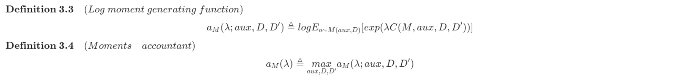
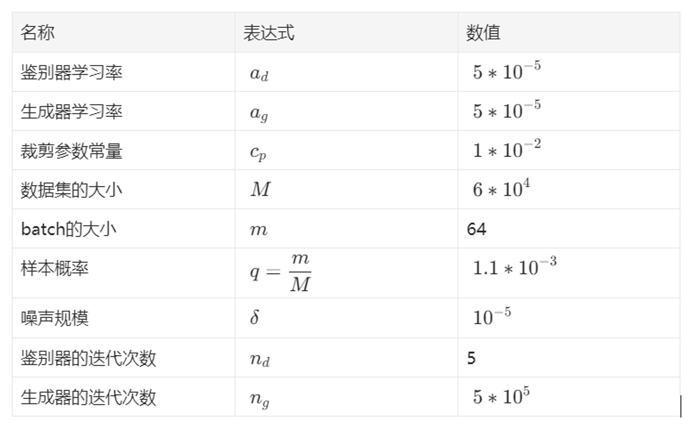
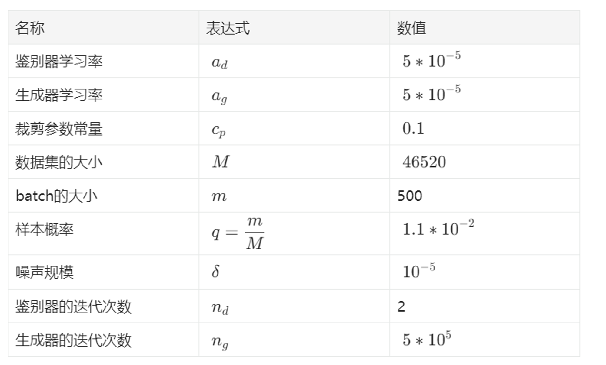

# 一、前言

        “生成对抗网络”(GAN)以及它的一系列变种，因为具备相当优雅的理论、杰出的性能，最近吸引了一大批科研工作者的兴趣。它的一个常见议题是，学习生成分布的密度可能会集中在训练数据点上，这意味着由于深度网络模型的高复杂度，它们可以很容易地记住训练样本。当GANs应用于隐私或者敏感数据时，这将是个大问题，而且由于数据分布偏向于集中，这可能会泄露关键的患者信息。·

        为了解决这个问题，作者提出了一个差分隐私GAN模型，他们通过向梯度添加精心设计的噪声来实现基于GAN的差分隐私，并为此提供了严格的证明。

# 二、介绍

## 2.1 论文结构

【描述】：疾病的复杂性（许多罕见病在世界范围内也没有多少样例）、隐私和敏感性的约束、昂贵且耗时的数据收集过程……使得在医疗领域，以深度学习的方式构建医疗分析模型仍旧具备相当的挑战性。

【问题】：①数据量不太大；②数据有残缺；③隐私数据的处理问题；④构建高质量的分析模型。

【处理】：使用生成模型，结合深度学习和博弈论的知识，生成对抗网络（GAN）可以生成难以与真实样本区分的高质量“假样本”，同时可以仅向公众或者受限个人发布数据的分布，以此来保护隐私。

【问题】：GAN仍旧会隐式地披露隐私数据，这是由对抗训练过程以及深度神经网络的复杂性决定的：它们鼓励围绕训练样本的分布。这样通过重复采样，就有相当大的可能性恢复训练样本。

【方案】：提出了差分隐私对抗生成网络（DPGAN）。具体而言，将精心设计的噪声和梯度裁剪结合，同时使用Wasserstein距离来代替GAN中的JS-发散。

【创新】DPGAN除了裁剪权重之外，还证明了梯度也可以同时限定，从而避免了梯度的不必要失真，不仅仅保留了Lipschitz property的损失函数，还提供了足够的隐私保证。区别于隐私保护深度学习框架（隐私损失与公共数据集里需要标记的数量成正比），DPGAN的隐私损失与与生成的数据量无关。

## 2.2 前人工作

1. **生成对抗网络：** 着重介绍了Gulrajani、zhao等人的工作。

2. Gulrajani 通过惩罚关键梯度的范数作为其输入的规范，而不仅仅是裁剪权重，提高了WGAN的训练稳定性和性能。并且由于梯度规范的受控值，这与差分隐私框架能够保持一致。

3. Zhao 等人介绍了“基于能量的GAN”。它将鉴别器视为一种能量函数，这个函数把低能量归因于数据主流附近的区域，把高能量归因于其它地区。近似于原始的GAN，生成器被训练来产生具备最小能量的对比样品，而鉴别器被训练为向这些生成样例分配高能量。

4. Berthelot 等人使用自动编码器作为鉴别器，并开发了一种均衡执行的方法，它综合了以Wasserstein距离得出的损失。并通过平衡生成器和发生器的功率来改进WGAN，从而控制图像多样性和视觉质量之间的权衡。

5. Qi提供了一种损失敏感型GAN。它基于对数据分布和损失函数的Lipschitz假设。这个模型允许生成器专注于改进那些于真实样例差别过大的不良数据点，而不是浪费精力在那些已经生成良好的的样本上。

6. 还有Jones、Choi...的工作简介。

7. **差分隐私：** 主要介绍了Dwork（基于灵敏度的算法，添加噪声来掩盖数据相关功能的最大变化）、Chaudhuri（DP经验性风险最小化，目标扰动，而非直接在输出参数上添加噪声）、Song（随机梯度下降的DP变体，适当增加batch大小能够显著提高性能）等人的经验和工作。

8. **神经网络中的差分隐私学习：** 主要总结了Abadi（梯度裁剪法，在训练过程中添加隐私）、Shokri和Shmatikov（多方隐私保护神经网络，具备并行和异步）、Papernot（将拉普拉斯机制和机器教学框架结合）、Phan（自适应拉普拉斯机制，可用于一系列不同的深度神经网络，而隐私预算消耗独立于训练步数）等人的经验成果。

最后作者总结了自己工作与前人工作的区别：

1. 训练一个差分隐私生成期，可以在不侵犯训练数据隐私的情况下生成无限数量的数据点，而Papernot等人的工作中，隐私损失和公共数据集中标记的数据量成正比。

2. 通过避免使用分布式框架来回避Shokri和Shmatikov遇到的“服务器和本地之间传输更新参数，导致泄露私人信息的风险”问题。

3. 在训练过程中添加噪声，而非在能量函数和额外的softmax层上添加噪声，这区别于Phan。

# 三、方法

## 3.1 差分隐私

<Image src="https://cdn.nlark.com/yuque/__latex/54b932c6b939ae22d537ff795cb80868.svg" alt="https://cdn.nlark.com/yuque/__latex/54b932c6b939ae22d537ff795cb80868.svg" />

        不同于“差分隐私知识学习汇总笔记”这篇里的定义，文章中使用了(ε, δ)-差分隐私。δ的意义在于，它允许违反“纯差分隐私”的行为出现。

        具体来说，存在一个概率为δ的输出范围，使得在该范围的一些固定点（例如点S），无论ε的值是多少，总存在一对邻近数据集D和D'，使得以下不等式成立：

## 3.2 GAN和WGAN

        GAN同时训练两个模型：一个是生成模型G，它将输入分布转化成近似于数据分布的输出分布；一个是鉴别模型D，它用于估计一个样本来自于训练数据集而非输出集G的可能性。

        令 $p_z(\textbf{z})$ 表示G的输入噪声分布，$p_{data}(\textbf{x})$ 表示真实的数据分布。GAN旨在训练G和D去玩以下这个基于值函数V(G, D)的双人游戏：

$$
\underset{G}{min}\space\underset{D}{max}\space V(G, D)=E_{\textbf{x}\sim p_{data}(\textbf{x})}[log(D(\textbf{x}))]+E_{\textbf{z}\sim p_{z}(\textbf{z})}[log(1-D(G(\textbf{z})))]
$$

        WGAN 通过使用 Wasserstein 距离，而非 Jensen-Shannon 距离，来改进GAN。它旨在解决如下一个不同的双人minmax游戏：

$$
\underset{G}{min}\space \underset{w\in W}{max}\space E_{x \sim p_{data}(\textbf{x})}[f_w(\textbf{x})]-E_{\textbf{z}\sim p_z(\textbf{z})}[f_w(G(\textbf{z}))]
$$

        其中，${f_w(\textbf{x})}_{w\in W}$ 函数都是K-Lipschitz的，在下面就用到了这个性质。

## 3.3 DPGAN 框架

        主要在训练过程中，而非在最终参数里添加噪声将相对于训练数据的Wasserstein距离上的梯度的噪声相加。鉴别器的参数已经保证能够相对样本训练点实现差分隐私。我们注意到，被采样来用于训练的数据点的隐私已经很自然地被保证了。这是因为替换这些样例不会对输出的分布造成任何改变，这个相当于差分隐私里ε=0的情况。

        生成器的参数也可以保证与训练数据相关的差分隐私。**这是因为存在一个差分隐私的后处理性质，它表示在一个差分隐私输出之后的任何映射操作都不会侵犯隐私。** 这里的映射事实上是指，生成器的参数进行计算，然后输出的是鉴别器的差分隐私参数。既然生成器的参数已经确保了数据的差分隐私，那么在训练过程后生成数据也是安全的。

        简而言之，我们有：差分隐私鉴别器+生成器计算——>差分隐私生成器。这意味着，即使观察者得到了生成器本身，他也不可能入侵训练集的隐私。

        以下为算法的伪代码：

        其中，RMSProp是一种优化算法，可以根据梯度的大小自适应地调整学习速率。

## 3.4 DPGAN的隐私保证

        作者证明了相对于样本训练点，生成器的参数θ保证了差分隐私，因此，从G生成的任何数据都不会泄露训练点的隐私。

        通过矩统计机制，可以计算最终的结果ε。通过将鉴别器的参数 $w^{t_2+1}$ 视作输出空间的一个点，很容易就能够看出，在任何循环中，对于固定的t2，更新w的过程就是定义3.1中的算法Ap。这里输入Ap的是真实数据和噪声，输出是更新的w。所以有Ap(D)=M(aux,D)，其中aux是一个辅助输入，在我们的算法中，它指的是先前的参数 $w^{t_2}$，因此，算法第3-10行就是一个自适应的过程。很容易就可以定义在o处的隐私损失：

        它描述了通过改变数据产生的两个分布之间的差距。隐私损失随机变量的值由以下式子给出。

        需要注意到，我们假设了这样一个前提：和M(aux, D)、M(aux, D')相关的2个分布集合是一样的，所以使用相同的点o去评估它们是安全的。

        如果存在这样的一个区域s，它支持M(aux, D)，但不支持M(aux, D')，那么C的结果就会变为∞，隐私保护也就不存在了。

        我们定义对数矩统计函数和矩统计为：

        为了使用矩统计，需要 $g_w(\textbf{x}^{(i)},\textbf{z}^{(i)})$ 被限定住，然后根据这个限定来添加噪声。作者证明了，只裁剪w也可以自动保证gw的边界。

        然后作者证明了几个引理：

        得到了结论：

# 四、实验

## 4.1 隐私等级和生成性能之间的关系

        参数设置如下：

        其余说明：

- $B_{\sigma'}\leq1$，其中 $B_{\sigma'}$ 是激活函数导数上的边界。

- z的维数限制为100，每个坐标都在[-1,1]内。

- 选择类似DCGAN的网络结构，选用均值为0的高斯噪声

- 在生成器和鉴别器的权重上添加L2-正则化。

        结论：

        其他条件相同时，噪声方差越大，生成的图像越模糊。

## 4.2 隐私等级和网络融合之间的关系

        绘制了每100次生成器迭代的Wasserstein距离。结果表明Wasserstein距离在训练过程中逐渐减小并最终收敛。

        更小的ε会导致更加频繁的波动和更大的方差。

        峰值经常在Wasserstein距离收敛后出现，但这种峰值会随着训练过程的推进而消除，并且使得网络保持稳定。

## 4.3 MNIST数据分类

        以一对数字 0 和 1 为例，从它们自己的训练样本（使用所有样本）中分别生成 0 和 1，具有不同ε值。对于每个数字，生成相同数量的数据作为训练样本。然后，对于固定ε（以及训练集），从生成的数据中随机选择4000个样本（包含2000个样本，包括0和1），在这些样本上构建分类器并在MNIST的测试集上进行测试。然后重复此操作 100 次，并使用根据训练数据构建的分类器和生成的具有不同标准偏差的分类器来显示测试集的准确性。最后还对数字对 23 和 45 运行相同的过程。

        结果表明，存在一个阈值，低于该阈值时，生成质量受到的影响很小。因此建议选择大于该阈值的ε，增加较少的噪声，以便生成的数据不会受到太大的影响。

## 4.4 电子健康记录

        阈值设为0.5。

        从整体上看，从这个实验可以看出，作者的模型确实在医疗数据的差异隐私意义上提供了保护，解决了我们抽象提到的问题。

        由于噪声的扰动，疾病的罕见性也得到了很好的保护。假设有一个公开可用的基于特定人群的EHR生成的EHR数据，保险公司可能会根据从生成的EHR数据推断出的统计信息，提高患罕见疾病的人的保险费。由于DPGAN可能会改变疾病的罕见性，因此保险公司无法从我们生成的数据中准确获得此类信息，因此这群人的利益得到了保证。

        结果还表明了生成模型捕获训练数据分布的程度。

## 4.5 电子病历数据的分类

        作者使用按维度预测以评估生成模型恢复数据维度之间关系的程度。

        DWpre的基本思想是从训练集和生成的集合中选择相同的列作为目标，并将其余列设置为特征。然后，我们在它们上构建逻辑回归分类器，并在测试集上进行测试。这里的一个假设是，两个分类器的更近距离性能表示生成集的质量更好。由于测试数据高度不平衡（0占主导地位），作者在这里使用AUC作为测量。

        结论是：尽管在大多数情况下，从真实数据训练的分类器比从生成的数据训练的分类器表现更好，但生成的数据的AUC值随着ε的减少而减小（增加更多的噪声）。这是因为噪声会干扰鉴别器的训练并间接影响发生器，从而导致输出分布与实际分布的偏差，并可能导致测试性能不佳。也可以看出，性能并没有太大的下降。

        随着更多噪声的增加，这些点变得越来越稀疏，这反映了噪声对数据的另一种影响。这是因为作者使用逻辑回归来执行二元分类，这不允许单标签列。稀疏列广泛存在于原始数据中，如果存在更多扰动，生成模型更难捕获原始数据的某些列的稀疏性。更多列被学习为全零，并在分类任务中选择为目标时被丢弃。

        总之，隐私性越高，生成模型捕获跨维关系的能力就越差。此外，我们的框架成功地解决了差分隐私系统中的问题，即添加噪声会导致系统性能下降太多。

# 五、总结

        提出了一种隐私保护生成对抗网络（DPGAN），该网络在差分私有意义上保护训练数据的隐私。该算法经过严格验证，可以保证（ε，δ）-差分隐私。作者进行了两次实验，表明他们的算法能够生成高质量的数据点，并在训练数据的噪声和限制条件下收敛，并且具有有意义的学习曲线，可用于调动超参数。对于未来的工作，他们将考虑通过尝试不同的裁剪方式来减少隐私预算，并收紧实用程序绑定。
