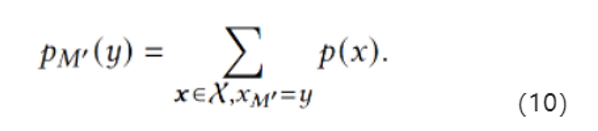

# 一、摘要

        这篇文章研究的是差分隐私下的高维数据集的合成。之前的方法是：首先生成一个输入数据D的低维度噪声边际集合M，然后使用这个M来不断近似成D的数据分布，以此来进行合成数据生成。但是，这种方法会对M有诸多的限制，从而对于边际的选择产生了制约。这样就难以把握住属性间的所有重要关系，最终导致了结果合成数据的质量降低。

        为了解决这个问题，作者提出了PrivMRF，这是一种同样使用了“利用低维度边际集合M来合成高维度DP数据集”的方法，除此以外，还保证了在边际选择上的高适应性。其中一个关键的思想是选择一个相关的M来建立一个马尔可夫随机场（MRF），对输入数据的属性之间的相关性进行建模，然后使用MRF来进行数据合成。在统计和分类问题上，PrivMRF方法的精确度会更高。

# 二、介绍

        “在保护隐私的同时能够揭露相关数据”，一个典型的（canonical）的方法是采用“合成数据集”。

## 2.1 合成数据集

        首先假设我们有一个数据集D。它有三个属性A1,A2,A3。每个属性有两个可选的域值{α，β}。一共有如下9条记录：

| A1  | A2  | A3  |
|:---:|:---:|:---:|
| α   | α   | β   |
| α   | α   | β   |
| α   | α   | β   |
| α   | β   | α   |
| β   | α   | α   |
| β   | α   | α   |
| β   | α   | α   |
| β   | α   | α   |
| β   | β   | α   |

        为了生成一个合成数据集，我们先统计所有记录中不同类型出现的次数：

| A1  | A2  | A3  | Count |
|:---:|:---:|:---:|:-----:|
| α   | α   | α   | 0     |
| α   | α   | β   | 3     |
| α   | β   | α   | 1     |
| α   | β   | β   | 0     |
| β   | α   | α   | 4     |
| β   | α   | β   | 0     |
| β   | β   | α   | 1     |
| β   | β   | β   | 0     |

        然后往里面加入噪声进行掩盖：

| A1  | A2  | A3  | Count |
|:---:|:---:|:---:|:-----:|
| α   | α   | α   | -0.2  |
| α   | α   | β   | 2.9   |
| α   | β   | α   | -0.3  |
| α   | β   | β   | 2.2   |
| β   | α   | α   | 1.7   |
| β   | α   | β   | 0.2   |
| β   | β   | α   | 0.8   |
| β   | β   | β   | -0.1  |

        然后舍去所有的count为负的记录，再把所有count为正的记录进行四舍五入后，给出新的“合成数据集”。我们可以证明这种方法符合一定隐私成本的差分隐私：

| A1  | A2  | A3  |
|:---:|:---:|:---:|
| α   | α   | β   |
| α   | α   | β   |
| α   | α   | β   |
| α   | β   | β   |
| α   | β   | β   |
| β   | α   | α   |
| β   | α   | α   |
| β   | β   | α   |

## 2.2 维度爆炸

        这种生成方式是存在问题的，最大的一个缺陷是维数爆炸。在第二张的count表中，记录的数量m和属性数量d之间存在指数级的关系：$m=2^d$。当d很大的时候，m会极其庞大，用这种方式来生成数据集，**在计算count表时就会消耗很大的时间和空间资源**。此外，随着d的增大，数据集里的记录数很大程度上会远小于m，这就表示count表中会存在大量的空白。**在第二步往里面添加噪声时，原本大量的稀疏边际会被添加入大于0的噪声**，这样产生的数据集D'将会有差的可用性。

## 2.3 贝叶斯理论

        为了规避（circumvent）维度爆炸，现有的方法提出了一种贝叶斯的方法。它规避了直接生成count表，而是使用了count表的两个低维度的边际。M1（对M2也适用）捕获了A1和A2之间的联合分布性，这使得我们能够按照如下的规律来近似D中的数据分布：

        这样我们就能够往这些低维度的分布里添加噪声，然后根据上式来生成合成数据集。这样做的好处是它只需要处理低维度的边际，这样对噪声的注入会更有弹性，从而提高生成模型的效用。

## 2.4 相关的贡献

        但是，贝叶斯网络并不是完美的。它对M有一系列的限制。尤其是，**PrivBayes要求M的边际必须符合一个贝叶斯网络**，这就使得M的边际个数最多只能是d。结合“**每个边际都得是低维度的**”，**这就使得贝叶斯方法很难去捕获D中所有重要的属性关系**，从而导致了贝叶斯网络的低效用。

        为了解决这个问题，作者提出了PrivMRF方法。它同样使用了低维度的边际M来去近似输入数据集D。不同之处在于，**它不需要M是一个贝叶斯网络，相反，它允许M出现任意的边际，只要它能够有效地从边际推导出合成数据集的分布**。这使得PrivMRF能够更准确地去捕获属性间的关系。

        PrivMRF的重点在于**选择合适的边际来去构造一个马尔可夫随机场，有效地模拟D中属性间的依赖关系**，然后使用M的噪声版本来生成合成数据集。不过现有的方法不能满足这个场景，例如缺少DP环节，或者只是理论模型。因此作者实现了相关的算法，不仅保留了DP功能，而且还兼备时间和空间上的优越性。

        最后是把PrivMRF和之前的实验方法进行了相关的比较，在此不再赘述。

# 三、前置知识

## 3.1 问题定义

        D是一个这样的数据集：它有d个属性A={A1, A2, ..., Ad}，n个元组 x^(1), x^(2), ..., x^(n). 对于所有的$A\in \Alpha$，且j∈[n]，$x_A^{j}$ 表示第j个元组里A属性的属性值。对于任意的属性集合$M\subseteq \Alpha$ ,令 $x_M=(x_A)_{A\in M}$ 表示局限于M的元组x的子集。令T_{D,M}表示所有 元组 $m \in \chi_M$ 出现次数的统计表，也即：

        我们可以通过把T_{D,M}的每个条目除以n来获得M的边际分布。我们的目标是使用一种算法，在满足 (ε，δ)-DP 的前提下，发布基于D的合成数据集$\widetilde{D}$。

## 3.2 高斯机制

        在本文，作者添加的是基于L2敏感度的高斯机制的噪声。L2敏感度的定义如下，这是一个二级范式。

        高斯机制下，差分隐私的定义可以改写为：

## 3.3 PrivBayes

        PrivBayes使用如下的三步来生成一个合成数据集：

- 从输入数据集D的边际中选择一个集合M使用一个差分隐私算法

- 向列联边际分布T_{D,M}中添加噪声，获得它的噪声版本 $\widetilde{T_{D,M}}$

- 使用这个噪声版本生成所需的$\widetilde{D}$

        步骤 (1) 确保 M 中的边缘可以按序列 𝑀1, 𝑀2, ... 排列，这使得对于任何 𝑖 ≥ 2, 𝑀𝑖 只包含一个不在 𝑀1, 𝑀2,  . . , 𝑀𝑖−1中的属性 𝑌𝑖。因此，M 中的边缘对应于特定类型的贝叶斯网络 [21]，它是 𝐷 中属性之间依赖关系的概率模型。基于贝叶斯网络，我们可以将𝐷中的数据分布近似如下：

        步骤 (2) 生成每个边缘的噪声版本$\widetilde{T_{D,M_i}}$ 。观察到，对于任何 𝑖 ≥ 2，我们可以基于$\widetilde{T_{D,M_i}}$ 中的噪声计数推导出 Pr[𝑌𝑖 | 𝑀𝑖 \ {𝑌𝑖 }] 。此外，我们可以以相同的方式从$\widetilde{T_{D,M_i}}$ 获得 Pr[𝑀1] 的噪声版本。给定这些噪声分布，PrivBayes 的步骤（3）在 $\widetilde{D}$ 中生成每个合成元组 $\widetilde{x}$ 。首先，我们从嘈杂的 Pr[𝑀1] 中采样 $\widetilde{x_{M_1}}$ 。然后，对于每个 𝑖 = 2，. . . , |M|，我们根据嘈杂的 Pr[𝑌𝑖 | 对 $\widetilde{x_{Y_i}}$ 进行采样。例如，假设 M 分别包含表 5 和表 6 中的两个边际 𝑀1 和 𝑀2。然后，根据式 (1)，我们将通过首先从 Pr[𝐴1,𝐴2] 的噪声版本中采样$\widetilde{x_{(A_1, A_2)}}$ 来生成每个合成元组 $\widetilde{x}$ 。之后，我们检查 $\widetilde{x_{(A_1, A_2)}}$ 的采样值，然后基于 $\widetilde{x_{A_1}}$ 从 Pr[𝐴3 |𝐴1]  中采样$\widetilde{x_{A_3}}$。

        PrivBayes使用贝叶斯网络，它有两个优势：（1）允许使用M中的低维度边际来近似输入数据D，从而减轻了维度灾难；（2）允许使用噪声边际和上面的公式4来高效地生成合成元组。

        但同样的，它要求每个Mi都必须包含一个其他M1,...Mi-1里不存在的属性，因此M的个数最多只有d。再加上M本身是低维度的，这样一来，M就很难充分地捕获D中属性的关系。

## 3.4 PGM和连接树

        如果使得M不遵循贝叶斯网络的规则的话，我们也无法使用公式4来近似了。不过还存在一种相对有效的算法PGM，基于一组任意的噪声边际集合来推导联合分布。

PGM的基本原理是从M里构建一个“联合树”（Junction Tree）来促成Pr[A1, A2,..., Ad]的近似结果。具体来说，一棵联合树由一组满足以下两个条件的有序边际C={C1,C2,...,}组成：

- D中的每个属性都被C中至少一个边际包含

- 属性集 $S_i = C_i∩(∪_{j=1}^{i-1}C_j)$ 出现在C1, C2,...,Ci-1中的一个里

        我们可以通过联合树来给出如下的近似分布：

        PGM采用如下的标准算法来从M中获得一棵联合树C：

- 构建一个属性图G：(i) 图里的每个结点都是D中的一个属性；(ii) 当且仅当A和B出现在M的同一个边际时，A和B之间以无向边连接；

- 通过在 𝐺 中插入边对 𝐺 进行三角剖分，这样对于𝐺 中的每个循环 (𝑣1, . . . , 𝑣𝑘 , 𝑣1)，由𝑣1, . . . , 𝑣𝑘 包含至少一个三角形。例如，如果 (𝑣1, 𝑣2, 𝑣3, 𝑣4) 是 𝐺 中的环，则 (𝑣1, 𝑣3) 或 (𝑣2, 𝑣4) 应该是 𝐺 中的边；

- 令𝐺△ 是 𝐺 的三角化版本。将 𝐺△ 中的每个最大团作为 C 中的一个团；

- 推导出一个正确的顺序使得团集合C={C1,C2,...}满足一棵联合树的需求。

        上述的步骤是零隐私成本的，因为它只对属性进行操作，而没有对“count”操作。除此以外，这个算法还保证了每个M中的边际都至少属于C中的一个边际。我们把从M到C的转化称为“联合树转换”。一旦我们得到了C，PGM就会执行图形化的模型估计和推理，从 $\widetilde{T_{D,M_i}}$ 中推导出C的边际分布。之后，我们就能够基于式子5生成合成数据集了。

## 3.5 PGM的局限性

        PGM的问题在于，它没有提供一种方法来决定哪个边际应该首先被使用。换而言之，它要求噪声的边际应该由使用者来给出。

        但是，PGM生成的合成数据集质量高度依赖于给定的边际集合M。例如，如果M包含了d个单属性边际，那么从M中获得的联合数据分布就会变成单属性边际分布的笛卡尔积，这样一种联合分布和D中的原始数据分布几乎不可能接近。我们固然可以尝试通过将包含相关属性的每个可能的多维边际插入到 M 中来解决这个问题，但由于两个问题，它仍然会导致合成数据较差

- **过大的边际噪声**。我们需要将噪声注入M的每个边际中来实现DP。当M包含大量的边际时，M透露的隐私量是很大的，我们需要在每个边际中都加入大量的噪声来保证隐私，这将严重降低了噪声边际和合成数据的准确性。因此，如非必要，在确保了效用之后，不应该再加入多余的边际了。

- **过大的开销**。PGM基于式子5来推导一个联合数据分布。这需要在联合树中为每个团Ci实现边际分布。而每个Ci又是从属性图 𝐺 三角剖分的图 𝐺△ 中的一个最大团。当M包含大量的边际的时候，G将是一个密集图，因为出现在同一个边际中的每一对属性都将映射到G中的一条边。那么同样的，𝐺△也会是密集的。这样的话，𝐺△中的一些最大团Ci可能包含大量的属性。也即是说，当图本身比较“坏”（密集）的时候，PGM并不能有效地划分出属性量较少的团出来，这样也就无法节省时间和空间的开销。

        因此，我们需要根据三个约束条件来仔细地构造M：

- CSTR1: M中的边际应该是低维度的，并且应该能够捕获输入数据的重要特征；

- CSTR2: M的大小应该相当小；

- CSTR3: M上使用联合树变换不应该导致任何具有大域大小的团出现。

        综上，问题归结于：

        **能否设计一个边际选择算法，它满足DP，符合上述的三个约束条件，以此获得具备更好效用的合成数据集生成？**

# 四、解决方案

## 4.1 属性图生成

        给定一个数据集D，PrivMRF算法从生成一个结点都是D中属性的属性图G开始。这一步需要确保如下的情形：（1）G中的每条边都连接了两个高度相关的属性；（2）如果我们对G进行三角化，那么G△不会出现任何可能的大团。一旦图G生成了，那么G△中的最大团将用于PrivMRF的后续步骤来构建一个边际集合，从而生成合成数据集。以下为该步骤的伪代码：

        其中，R(A,B)的定义如下，其中n为D中元组的数量

        这个算法干了这样的一件事：

- 首先对每个属性A和B计算R(A,B)并加噪。做如下推导，不难发现，当A和B的关联性越高，这个值就会越大。（WHY？）

- 然后按照R的分数降序排列，采用贪心法从中不断挑选出属性对(A,B)

- 把该边加入G中，三角化，判断G△里的最大团的域值是否大于一个预先设定的标准t，没有就把边(A,B)加入图G，并从候选边集中去掉

- 不断重复上述两步，直到边集为空，返回C（图G△里最大图的集合）

        这个算法存在两个可疑点，需要后续阅读的时候注意：

- **R(A,B)代表了A,B之间的关联性。但是我们知道，最好的能够表达关联性大小的应该是协方差以及协方差的变体。直觉来看，R(A,B)应该不一定会随着A和B的关联性增大而增大。**

- **作者希望高R分值的属性对(A,B)能够映射到图G中的边上。但是，这种映射是否是最优的呢？贪心法不一定能够保证这个结果的正确性。**

## 4.2 选择候选边际集合

        在获得上面生成的C和G△之后，PrivMRF将会构建一个“备选边际集合”μ出来，它将被连续使用来去推导出最终的边际集合M。

        构建集合M的过程遵循了两个原则：

- **过滤掉那些违反了CSTR1和CSTR3的边际**

- **缩小后续步骤中的边际选择的范围**

        为了实现这个目的，PrivMRF算法对候选边际集合μ中的边际强加了两个需求：

- 首先，μ中每个边际都应该包含C中某些图的属性的子集。这主要是保证了联合树不会包含那些域值大于t的图，满足了CSTR3。

- 其次，μ中的每个边际都应该是θ-有用的。它的定义如下。其中，g是将要注入到每个计数中的噪声的预期绝对值，θ是一个常数。换句话说，我们要求M里的平均计数应该至少是噪声标度的θ倍，这样即使是在噪声版本下，仍旧能够捕获信息。这样足以满足CSTR1。

这一步过程如算法2所示：

        注意到，这里使用了n的噪声版本，因为n是一个敏感的信息，所以需要进行DP保护。

## 4.3 初始化边际集合M

        初始化M的过程如下所示：

        首先令M为空集，然后对D中的每个属性A不断地做如下的试探：

- 在候选边际集合μ中，选出那些包含了A的边际，然后不断测试它们是否满足了如下的式子。在所有结果中，取最大的那一个边际。

- 然后把该边际放入M中，然后将其从μ中移除。

        这个式子的作用在于衡量A和M中其他属性的关联度。这一步确保了M包含了至少一个能够捕获A和其他属性之间强关系的边际。

# 4.4 细化边际集合M

        在初始化了M之后，我们需要通过往M里面添加额外的边际，来确保每个加入的边际能够捕获尽可能多的关于M中现有边际的额外信息。为了实现这个目的，作者构建了一个马尔可夫随机场，这是一个图形化的模型，用来表示封装在M中的信息。

        令x是D的域 $\chi$ 中的一个元素，$x_M$ 是x到M中属性的投影, $\theta _M(x_M)$ 表示和 $x_M$ 有关的θ。这样模型就可以表示为：

        其中，$exp(\theta_M(x_M))$ 可以理解为$x_M$的势能函数(?)。换而言之，给定一个θ，我们可以首先把每个投影到M$\in M$上x的势函数取乘积，然后再进行归一化。这样我们就能够使用θ来推测任意边际M'的边际分布：

        除此以外，对于任意M'，我们能够通过从$M$ 构建联合树来避免在计算 $p_{M'}(y)$的时候实现p(x)。

        总而言之，MRF算法允许我们使用 $M$ 来根据如下的方法去推测与C相关的边际分布：

- 给定$M$，我们能够根据噪声边际分布向量 $\widetilde{T}_{D,M}$ 来推导出MRF的参数向量θ

- 基于θ，我们可以根据式子10来推导每个属于C的团Ci的边际分布。

        为了实现这个步骤，需要仔细地选择 $M$ 和 θ，从而促进Ci边际分布的精确性估计。作者给出的算法如下所示：

        算法4做了这样的一件事：

- 在每次迭代的时候，先调用算法5来更新θi-1，获得θi。算法5采用了PGM里的镜像下降方法，从噪声边际来估计图形模型的参数。在这一步中，会不断估计 μi 和 $\widetilde{T}_{D,M}$ 之间的差距、更新θ的值，迭代直到μi收敛。

- 在获得θi和 μi 之后，从 $U$ 中随机采用K次获得一个$U’$，然后从边际里选择一个“最好”的插入到 $M$ 中。这个“最好”的评估标准是 $\widetilde{h}(M)$ 的大小。

- 然后更新 $\widetilde{T}_{D,M}$ 和 θi来对应M'的插入。

- 上述三步不断迭代。

        在这个算法中调用了下面这个算法5来生成θ：

        在初始化的时候采用了式8来构建边际集，在细化时使用了MRF算法。这样做有以下几个原因：

- 对于 M 的细化，需要确定新的边际，以根据捕获的信息来补充 M 中的边际。ρ函数不适合此任务，因为它仅测量同一边际中的属性之间的相关性，但不会导致一种有意义的方式来推断新边缘是否对现有边缘集 M 有用。相比之下，MRF 为我们提供了一种有规则的方法来衡量新边际在 M 之上提供的新信息量。因此，MRF 更适合于 M 的细化。

- 而对于M的初始化，如果直接使用MRF来从头构建M，算法4的前几次迭代就得从一个很大的随机边际集合U'中来进行评估，以确保U'包含初始化M的良好选择。这将产生巨大的计算、隐私成本。

# 4.5 从C开始合成数据

经由算法5得到了C之后，我们可以根据式5来生成合成元组 $\widetilde{x}$ ：

- 从C1的边际分布中采样获得 $\widetilde{x}_{C1}$

- 然后不断检查 $\widetilde{x}_{Si}$ ,并根据条件分布 $Pr[Ci-Si|Si=\widetilde{x}_{Si}]$ 采样 $\widetilde{x}_{Ci-Si}$

        换而言之，$\widetilde{x}$ 能够从每个Ci∈C中生成，每个合成元组都能够如此独立地生成。

        算法6描述了PrivMRF的执行过程。

        对于其余的“相关工作”和“实验比较”部分，过于流水，在此不再赘述。

# 五、整理

        本文涉及到的知识点不少，包括了：

（1）马尔可夫场

（2）贝叶斯方法（PrivBayes)

（3）PGM方法和联合树的构建

（4）诸多对于“最优”的判别方法

（5）相比起“分布”，本文更强调的是“边际概率”

        这五点在我看来是能够理解本文的重要因素，也是之后需要再次研读、重新整理的重要部分。

        除了本文的PrivMRF，之前研读的过程中，涉及到“数据集生成”的，还有DPGAN和3-7的研究方法。本文和3-7里一样，都涉及到了PGM和PrivBayes的比较和理解。对于这个话题，我认为接下来有必要进行针对性的理解和阅读，并整理成一个知识体系和进化树。
