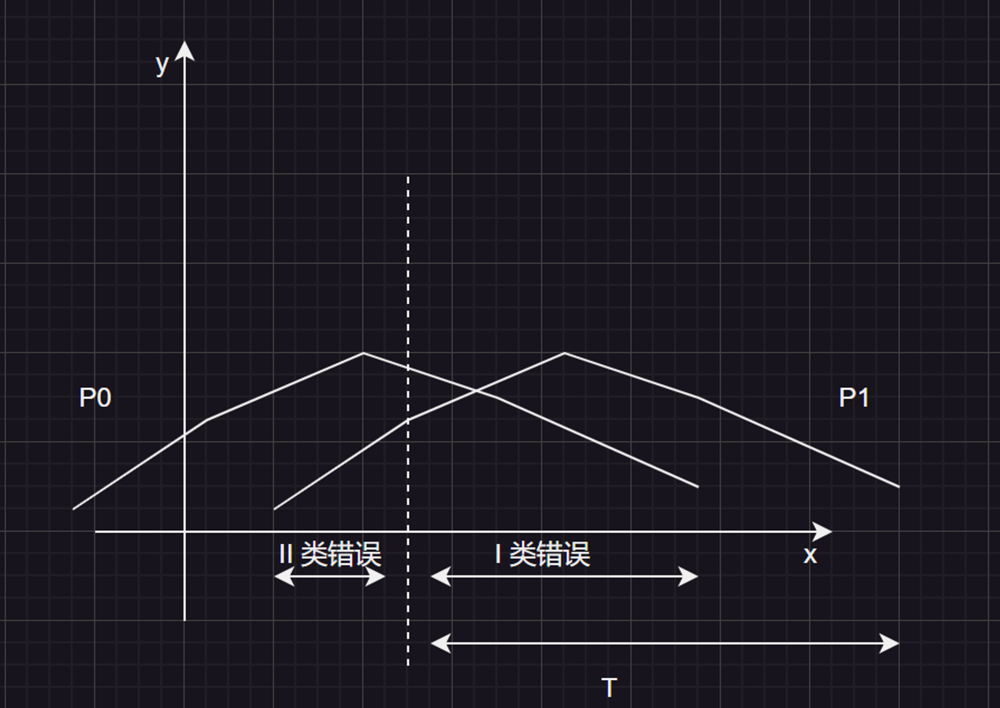
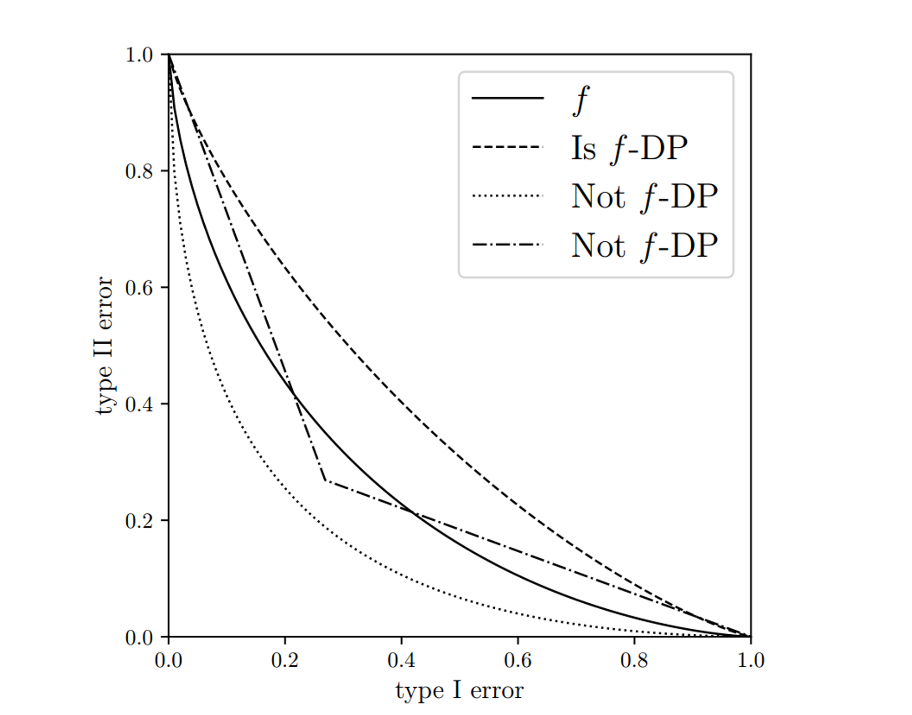
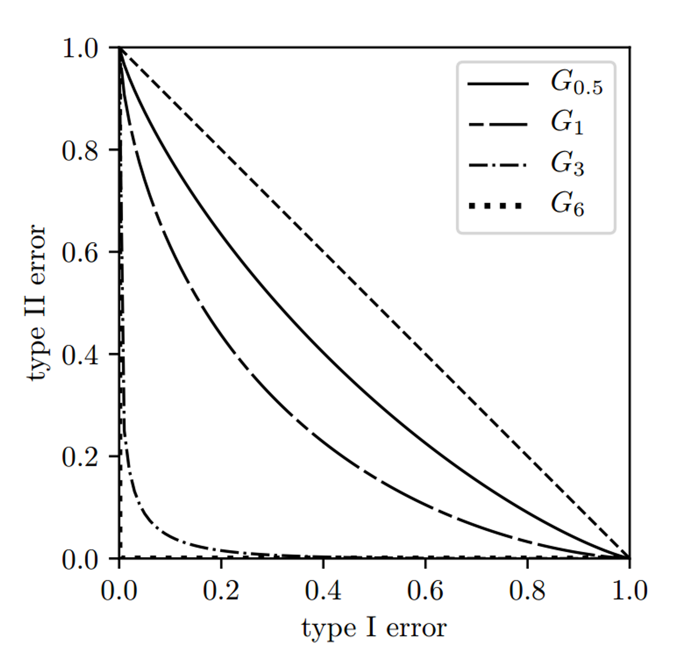

# 一、(ε, δ)-DP 的回顾

        (ε, δ)-DP 是经典的差分隐私范式，其一般格式是，对任意两个邻近数据集 D 和 D’，都有：

$$
P_{r}[M(D)\in S_{m}]\leq e^{\epsilon}×P_{r}[M(D')\in S_{m}]+\delta

$$

        这个式子是通过 相对熵 推导出来的，具体可以看[这里的解析](https://www.notion.so/06b44abe2e864a3a8c687870c3cf312e?pvs=21)。

        通过这道公式，人们可以设计出诸多不同的”机制“，来对数据集进行隐私保护，例如 拉普拉斯机制 和 高斯机制。前者通过添加具备”长尾“特性的拉普拉斯噪声来保护隐私，对离散型的数据具有比较友好的作用；后者的”对称特性“则更加适合用来保护连续数据的隐私，例如均值、方差…

        但是在面对”组合查询“这类的问题的时候，上述的 (ε, δ)-DP 范式就产生了问题：基于散度的定义式，难以给出直观的组合机制应该遵循的规则，只能使用放缩法来给出一个近似的上界。这方面的研究包括了 ”强组合定理“、”Moment Accountant“和”Renyi Accountant“等。

        这些组合机制大部分都是针对”期望“的高阶范式进行研究。例如：

- ”强组合定理“主要利用”隐私损失期望的上界“和”Azuma不等式“给出组合机制；

- Moment Accountant 将期望看成”一阶原点矩“，通过高阶的展开式进行推导；

- Renyi Accountant 通过考察 ”散度“的定义式，从高阶矩的定义出发，重写了差分隐私的表达式…

        具体可以参考[这篇的总结文字](https://www.notion.so/01-57425c15c00d4761b5b2c1801be45739?pvs=21)。总而言之，这些方法优化的思路就是：在机制中添加噪声，如果数据本身具备高维的特性，那么对应的噪声机制也应该考察维度的特性。在高阶展开式里添加更紧的上界，从而在符合DP的前提下，减少噪声带来的精度损失。问题在于：这些方法大部分都从”高阶“的角度来进行优化，并不直观；偏离了”差分隐私“的形象描述，比较抽象，因而其目的大多是为了找到一个更紧的上界作为组合机制的近似。

# 二、权衡函数——假设检验的引入

        在”[强组合定理](https://ieeexplore.ieee.org/ielaam/18/7931776/7883827-aam.pdf)“的文章中，作者引入了”假设检验“。但原文只是将其作为一个测试的直观标准。而本篇的作者则基于”假设检验“进行了更加深入的推导。

        首先，假设 S 和 S’ 是一对邻近数据集，M是一个隐私机制，P 和 Q 是机制 M 应用于这一对邻近数据集的概率分布。 那么对于攻击者而言，数据自然存在两种假设：

$$
H_0:落在\;S \; 中，H_1：落在 \;S’\; 中

$$

        这样一来，攻击者的判别错误就可以分为两个类别：

- 原假设正确，却拒绝了

- 原假设错误，却接受了

        我们将其分别记为 一类错误 和 二类错误。如下图所示，我们可以给出对应的示意图：

        在这个图中，我们假设 T 区域的为“拒绝域”，也就是拒绝假设 P0，接受假设 P1。根据这一点，很容易划分出 “I 类错误” 和 “II 类错误”：显然，P0 在 T 内的点，都是 I 类错误的；P1 在 T 左侧的点，都是 II 类错误的。而随着 T 区域的不断右移， I 类错误的概率会不断缩小，II 类错误的概率会逐渐增大。从而在这两类错误间，形成了一个“权衡”关系： trade-off。

        在假设检验中，我们通常会给定一个常量来判定”显著性水平“，记为 α。考虑一个”拒绝零假设的规则“ Φ（0 ≤ Φ ≤ 1），那么 I 类假设 和 II 类假设就可以表示为：

$$
\alpha_{\phi}=E_{P_0}[\phi], \;\; \beta_{\phi}=1-E_{P_1}[\phi]

$$

        而 I 类错误 和 II 类错误的一个限制条件是：

$$
\alpha_\phi+\beta_\phi \geq 1-TV(P_0,P_1)

$$

        其中，$TV(P_0, P_1)$ 是  $| P_0(A) - P_1(A) |$  在所有可测集合 A 上的上界。

        现在，我们需要一个标准来量化假设检验的难度，这样我们就可以利用这个值来作为隐私保护的标准。作者给出的表达式为：

$$
T(P,Q)(\alpha)=inf\{\beta_\phi :\alpha_\phi\leq \alpha \}

$$

        这个表达式的意思是，在框定 α 的前提下，考虑可实现的最小 II 类误差。我们将符合这样要求的函数记为 ”权衡函数（trade-off function）“。显然，如果这个函数值越大，就表明在给定显著性水平的前提下，最小的 II 类错误也越大，就越难区分两个分布了。

        对于函数  $f ：[0,1]→[0,1]$,  f 是 trade-off 函数的充要条件如下：

- f 是凸函数 ( convex function )

- f 是连续的

- f 是非递增

- $f(x) \leq 1-x \;\;for\;\; x \in [0,1]$v

# 三、f-DP 的定义

        在 [0,1] 上，如果均有 $g(x)  \geq f(x)$，那么我们将其记作 $g \geq f$。

        这样我们就可以给出 f-dp 的定义了：

$$
let \; f \; be \; a \; trade-off \; function,\;M \; is \;said\;to\;be\;f-dp\;\;if:\;\\

T(M(S),M(S'))\geq f,\;\\for\;all\;neighboring\;datasets\;S\;and\;S'

$$

        这个 f-dp 的定义是在说明：对于机制 M，如果基于发布的信息，区分任意两个临近数据集的难度，至少不弱于基于单个平局区分 P 和 Q 的难度，那么这个机制就是 f-dp 的。显然，f-dp 具有对称性。

        参考作者给出的这张图：

        这张图里给出了四份曲线。其中，实线是作为标准的权衡函数 f，只有全部在 f 上面的虚线才是符合 f-dp 的，部分位于 f 下方的曲线则不属于 f-dp。符合 f-dp 的权衡函数，从图中可以看出，当 I 类错误固定时，II 类错误的概率高于 f，也就更难区分 P 和 Q 了。

        在进一步讨论之前，我们根据上述的定义可以给出一个更严格的界限，如下所示：

        令机制 M 符合 f-dp，对于任意的 α ∈[0,1]，定义：

$$
f^{-1}(\alpha):=inf\{t\in[0,1]:f(t)\leq\alpha\}\\

f^S=max\{f,f^{-1}\}

$$

       则 M 符合 $f^S-DP$。显然，$f^S-DP$ 要比 f-dp 的隐私保护程度更好，这是因为：

- $f^S = max\{ f, f^{-1} \} ≥ f$

- $f^S = (f^S)^{-1}$

        这里注意到 $f^{-1} = T(Q,P)$，因此第二点不难证明。符合 f-dp 的机制 M 同时也符合 $f^S-dp$，这点并不明显，需要进行证明。其步骤如下：

> 证明过程暂时省略，此处仅作占位

        至此，我们给出了 f-dp 的定义和其图形意义。接下来我们关注的，是 $f-dp$ 和 $(ε, δ)-dp$ 之间的转换关系。

# 四、$f-dp$ 和 $(\epsilon, \delta)-dp$ 的对应关系，高斯机制

## 4.1 $f-dp$ 和 $(ε, δ)-dp$ 的对应关系rt

        这里直接给出对应的表达式：

$$
f_{\epsilon,\delta}(\alpha)=max\{0,1-\delta-e^\epsilon\alpha,e^{-\epsilon}(1-\delta-\alpha)\}

$$

        其函数图像为：

        对照上面给出的充要条件，$f_{ε, δ}$ 函数显然符合：①下凸函数；②连续；③非递增；④位于 1-x 下方，因此  $f_{ε, δ}$ 也是一个 trade-off 函数。这样，证明一个机制符合 (ε, δ)-dp 的问题，就转变成了在任意 α∈[0,1] 下，均有  $T(M(S), M(S’)) ≥ f_{ε, δ}$ 的问题了。

## 4.2 高斯机制的定义

        接下来我们将着重考虑 dp 中比较关键的 “高斯机制” 的表达形式。这里直接给出其表达式：

$$
G_\mu:=T(N(0,1),N(\mu,1))

$$

        也就是说，μ-GDP 的表现，直观上来讲就是鉴别 N(0, 1) 和 N(μ, 1) 的难易程度。我们还可以给出一个更直观的表达式：

$$
G_\mu(\alpha)=\Phi(\Phi^{-1}(1-\alpha)-\mu)

$$

        其中，Φ 是标准正态分布的累积密度函数，对于一般的正态分布，其累计密度函数如下，其中 erf() 为误差函数：

$$
\Phi(x)=\frac{1}{2}[1+erf(\frac{x-\mu}{\sigma \sqrt{2}})]

$$

        由其表达式可以看出，当 α 固定时，值随着 μ 的增加而递减。如下图所示：

        我们现在了解了 $G_μ-DP$ 在 $trade-off$ 情况下的表达式。接下来，我们关注的主要是：

① $G_μ-DP$ 在 trade-off 的表达方式下，具备哪些性质？

② $G_μ-DP$ 和 $(ε, δ)-DP$ 之间的联系？

③ $G_μ-DP$ 的组合性质是什么样的？

        首先，同样给出 μ-GDP 的定义。机制M，如果对于任意的邻近数据集 S 和 S‘，均有：

$$
T(M(S),M(S')) \geq G_\mu

$$

        则称：机制 M 符合 μ-GDP。

        这个定义的好处在于它的隐私保护意义是相当直观的。如上图所示，μ越大，相同 I 类错误 α 的前提下，II 类错误 β 就越小，攻击者就越容易分辨 S 和 S’，隐私保护的能力就越弱。

        接下来考虑“高斯机制”的加噪方式。

## 4.3 添加高斯噪声

        首先定义敏感度：

$$
sens(\theta)=sup_{S,S'}|\theta(S)-\theta(S')|

$$

        这里 θ 是要进行隐私分析考察的统计量，敏感度为全局敏感度。高斯机制是通过向统计量 θ 上添加高斯噪声，来模糊其从属 S 还是 S’。也就是说：

$$
M(S)=\theta(S)+\xi, \;\;\xi\sim N(0,sens(\theta)^2/\mu^2)

$$

        则 M 符合 μ-GDP。其证明过程如下所示：

$$
T(M(S),M(S'))=G_{|\theta(S)-\theta(s')|/\sigma}\geq G_\mu

$$

$$
let\; \sigma^2=sens(\theta)^2/\mu^2,\;\;T(M(S),M(S'))=T(N(\theta(S),\sigma^2),N(\theta(S'),\sigma^2)

$$

        在正态分布中，通过 $z=\frac{x-\mu}{\sigma}$，可以把一个一般高斯分布转化为标准正态分布。我们在这里以 $N(\theta(S),\sigma^2)$为标准，进行标准化，则在这个标准下，$N(\theta(S),\sigma^2)$将转化为 $N(0,1)$，$N(\theta(S'),\sigma^2)$ 将转化为 $N(\frac{\theta(S’)-\theta(S)}{\sigma},1)$，因此，上式可以继续写为：

$$
T(M(S),M(S'))=T(N(\theta(S),\sigma^2),N(\theta(S'),\sigma^2)=G_{|\theta(S)-\theta(s')|/\sigma}

$$

        又因为：

$$
|\theta(S)-\theta(s')|/\sigma \leq sens(\theta)/\sigma=\mu

$$

        根据 μ-GDP 的递减性质，可以得到：

        综上，符合 μ-GDP 隐私保护，证毕。

## 4.4 后处理性质

        如果机制 M 符合 f-DP，那么它的后处理过程也符合 f-dp。

## 4.5 高斯机制和 (ε, δ)-dp 之间的转换关系

         机制 M 是 μ-GDP，当且仅当它符合 (ε, δ(ε) )-DP，这里有：

$$
\delta(\epsilon)=\Phi(-\frac{\epsilon}{\mu}+\frac{\mu}{2})-e^\epsilon \Phi(-\frac{\epsilon}{\mu}-\frac{\mu}{2}),\;\;\epsilon\geq 0

$$

## 4.6 组隐私

        这里需要对“组隐私”（Group Privacy）的概念做个定义。这里暂时还没有涉及到后续的“组合定理”，考察的仍旧是单次查询的隐私保护。假设存在一系列的数据集：S=S0, S1, S2, …, Sk = S’, k ≥ 2, 且 Si 和 Si+1 是临近数据集。我们说 S 和 S’ 是 k-邻近数据集，也就是说， S 和 S‘ 之间最多有 k 个不同个体的差异。

        对于规模为 k 的组，机制 M 符合 f - DP, 如果对于所有的 k-邻近数据集 S 和 S’，都有：

$$
T(M(S),M(S'))\geq f

$$

        反过来，如果一个机制是 $f-DP$，那么对于规模为 k 的组，它将是：$[1-(1-f)^{\circ k}]-DP$ 的，其中：

$$
(1-f)^{\circ 1}=(1-f),\;\;(1-f)^{\circ 2}=1-f(1-f(x)),...

$$

        如果一个机制是 $\mu-GDP$，那么对于规模为 k 的组，它将是：$k\mu-GDP$ 的。

        这里有一个有趣的地方，令 $μ ≥ 0$， 且 $ε = \mu /k，$当 k 趋向于 ∞ 时，有：

$$
1-(1-f_{\epsilon,0})^{\circ k}\rightarrow T(Lap(0,1),Lap(\mu,1))

$$

        这个近似是比较准确的，即使当 k 很小的时候，精度也比较高。

# 五、组合定理

        设 X 为 数据集空间，n 为组合中的机制数量。令 $M_1: X \rightarrow Y_1$ 表示第一个机制，$M_2: X × Y_1 \rightarrow Y_2$ 表示第二个机制。简而言之，机制 $M_2$ 使用了机制 $M_1$ 的输出作为自己的输入。我们可以据此定义一个联合的机制： $M：X \rightarrow Y_1 × Y_2$：

$$
M(S)=(y_1,M_2(S,y_1)),\;\; y_1=M_1(S)

$$

        显然，这样的组合是可以不断递归下去的。总的来说，给定一系列的机制 $M_i : X × Y_1 × Y_2× Y_3…× Y_i-1 \rightarrow Y_i$，我们可以定义如下所示的组合：

$$
M:X\rightarrow Y_1× Y_2×... Y_n

$$

        这种类马尔可夫链的形式，使得我们可以直接运用相关的数学工具来进行分析。

## 5.1 一般组合定理

        考虑两个权衡函数 f 和 g，对于一些概率分布 $P, P’, Q, Q’$，有 $f = T(P,Q)，g = T(P’,Q’)$。那么这两个权衡函数的张量积可以被定义为：

$$
f \otimes g:=T(P\times P',Q\times Q')

$$

        根据作者的证明，$f \otimes g$ 也是一个权衡函数。张量积有许多有用的性质，例如：

- $\otimes$ 符号符合交换律和结合律

- 如果有 $g_1≥g_2$ ，那么 $f \otimes g_1 ≥ f \otimes g_2$

- $f \otimes Id = Id \otimes f$，其中，$Id(x)=1-x, 0≤x≤1$

- $(f \otimes g)^{-1} = f^{-1} \otimes g^{-1}$

        当然，$Id$ 可以看作是两个相*同分布的权衡函数。给定了张量积的定义后，我*们就可以给出一般组合定理了：

        令 $M_i(·, y_1, …, y_{i-1})$ 对于所有的 $y_1 \in Y_1, …, y_{i-1} \in Y_{i-1}$  都是 $f_i-DP$ 的。那么它们的组合机制将符合：

$$
M: X\rightarrow Y_1\times Y_2\times ...Y_{i-1} \;\;is\;\;

f_1 \otimes f_2\otimes ...f_{n}-DP

$$

        这个定理符合①封闭性；②严紧性。封闭性表现在，n个 f-dp 机制的组合，仍旧符合 dp 规范。严紧性表现在，给出的这个 $f_1 \otimes f_2\otimes ...f_{n}-DP$ 是一个紧界，一般来说不存在优化的空间了。

        特别的，对于高斯机制的 GDP 而言，组合定理相当简单：

$$
G_{\mu_1} \otimes G_{\mu_2} \otimes... \;G_{\mu_n}=G_{\mu},\;\; \mu=\sqrt{\mu_1^2+\mu_2^2+...+\mu_n^2}

$$

        因此，n 个  $\mu_i-GDP$  的组合机制是 $\sqrt{\mu_1^2+\mu_2^2+...+\mu_n^2}-GDP$ 的

## 5.2 中心极限定理

        研究中心极限定理的目的在于，虽然高斯机制下的最终组合表达式是简单的、明了的，但是对于一般的  $f_i-DP$ 组合机制，其最终的表达式往往是难以求解的，因此需要通过中心极限定理来求其近似值。

        中心极限定理的概念是：在许多情况下，对于独立并同样分布的随机变量，即使原始变量本身不是正态分布，标准化样本均值的抽样分布也趋向于标准正态分布。我们可以通过这个方法，来求出张量积 $f_1 \otimes f_2\otimes ...f_{n}-DP$ 的近似正态分布表达式，从而将其转化为单 μ 的GDP隐私保护。

        这里引入四个泛函：

$$
kl(f):=-\int_0^1 log|f'(x)|dx\\

\kappa_2(f):=\int_0^1log^2|f'(x)|dx\\

\kappa_3(f):=\int_0^1|log|f'(x)||^3dx\\

\overline{\kappa_3}:=\int_0^1|log|f'(x)|+kl(f)|^3dx

$$

        令  $f_1,…,f_n$  是对称的权衡函数，则  $\kappa_3(f_i)<\infin$ for all $1≤i≤n$。令;

$$
\mu:=\frac{2||kl||_1}{\sqrt{||\kappa_2||_1-||kl||_2^2}},\gamma:=\frac{0.56||\overline{\kappa_3}||_1}{(||\kappa_2||_1-||kl||_2^2)^{3/2}}

$$

        假设 $\gamma < 1/2$, 对于所有的 $\alpha \in [\gamma, 1-\gamma]$，有：

$$
G_\mu(\alpha+\gamma)-\gamma \leq f_1 \otimes f_2\otimes...\otimes f_n(\alpha) \leq G_\mu(\alpha-\gamma)+\gamma

$$

        当n 趋向于无穷时，可以得到以下近似：

$$
\lim_{n\rightarrow \infin}f_{n1}\otimes f_{n2}\otimes...f_{nn}(\alpha)=G_{2K/s}(\alpha), with \; \sum_{i=1}^{n}kl(f_{ni})\rightarrow K;\sum_{i=1}^n\kappa_2(f_{ni})\rightarrow s^2

$$

## 5.3 对 (ε, δ)-DP 的近似

        首先改写最终的表达式：

$$
f_{\epsilon_1,\delta_1} \otimes f_{\epsilon_2,\delta_2}\otimes...\otimes f_{\epsilon_n,\delta_n}(\alpha)

$$

        考虑张量积的形式，可以改写为：

$$
f_{\epsilon,\delta}=f_{\epsilon,0}\otimes f_{0,\delta}

$$

        进而有：

$$
f_{\epsilon1,\delta_1} \otimes ...\otimes f_{\epsilon_n,\delta_n}=(f_{\epsilon_1,0}\otimes...\otimes f_{\epsilon_n,0})\otimes(f_{0,\delta_1}\otimes...\otimes f_{0,\delta_n})

$$

        前者套用上面的结论，近似为 $G_{\sqrt{\epsilon_1^2+…+\epsilon_n^2}}$，后面那项可以化简为 $f_{0,1-(1-\delta_1)(1-\delta_2)…(1-\delta_n)}$，取 n 趋向于 ∞ 的近似，给定如下的设置：

$$
\sum_{i=1}^n\epsilon_{ni}^2\rightarrow\mu^2, \max_{1\leq i \leq n}\epsilon_{ni}\rightarrow 0,\sum_{i=1}^n\delta_{ni}\rightarrow \delta, \max_{1\leq i \leq n}\delta_{ni}\rightarrow0

$$

        有：

$$
f_{\epsilon_{n1},\delta_{n,1}}\otimes ...\otimes f_{\epsilon_{nn},\delta_{nn}} \rightarrow G_{\mu} \otimes f_{0,1-e^{-\delta}}

$$

# 六、整理

|          | $f-DP$                                                                                                                                                                                                                  | $(ε, δ)-DP$                                                                                                                        |
| -------- | ----------------------------------------------------------------------------------------------------------------------------------------------------------------------------------------------------------------------- | ---------------------------------------------------------------------------------------------------------------------------------- |
| 思想       | $Trade-Off : T(P,Q)(\alpha) = inf \{ \beta_\Phi : \alpha_\Phi \leq \alpha \}$                                                                                                                                           | $KL-Divergence : D_{KL}(P\|                                                                                                        |
| 公式       | $if\;:\; T(M(S),M(S’)) \geq f \;for\; all\; neighboring\; S\;and\;S'\\then\;M\;is\;f-dp\;$                                                                                                                              | $if:P(M(S)\in E)\leq e^\epsilon P[M(S’)\in E]+\delta\; for \; all\;neighboring\;S\;and\;S'\\then\; M \; is\; (\epsilon,\delta)-DP$ |
| 转化       | $f_{\epsilon, \delta}(\alpha)=max\{ 0,1-\delta-e^\epsilon\alpha,e^{-\epsilon}(1-\delta-\alpha) \}$                                                                                                                      |                                                                                                                                    |
| 高斯机制（定义） | $G_\mu := T(N(0,1),N(\mu,1))\\G_\mu(\alpha)=\Phi(\Phi^{-1}(1-\alpha)-\mu)，随着 μ 增加而保护性递减\\M\;is\; \mu-GDP\;if\;:T(M(S),M(S'))\geq G_\mu$                                                                                 |                                                                                                                                    |
| 高斯机制（加噪） | $M(S)=\theta(S)+\xi, \xi \sim N(0,sens(\theta)^2/\mu^2)\\then \; M\; is\; \mu-GDP$                                                                                                                                      | $M(S)=\theta(S)+\xi, \xi \sim N(0,\frac{2sens(\theta)^2log(1.25/\delta)}{\epsilon^2})\\then\;M\;is\; (\epsilon,\delta)-DP$         |
| 转化（高斯机制） | $if\; M\; is\; (\epsilon,\delta(\epsilon))-DP\;for\;all\;\epsilon \geq 0,\;and \\\delta(\epsilon)=\Phi(-\frac{\epsilon}{\mu}+\frac{\mu}{2})-e^\epsilon\Phi(-\frac{\epsilon}{\mu}-\frac{\mu}{2})\\then\; M\;is\;\mu-GDP$ |                                                                                                                                    |
| 组合       | $G_{\mu_1}\otimes …\otimes G_{\mu_n}=G_\mu,\;\mu=\sqrt{\mu_1^2+…+\mu_n^2}$                                                                                                                                              | $Moment\;Accountant\\Rneyi\;Accountant\\……$                                                                                        |
