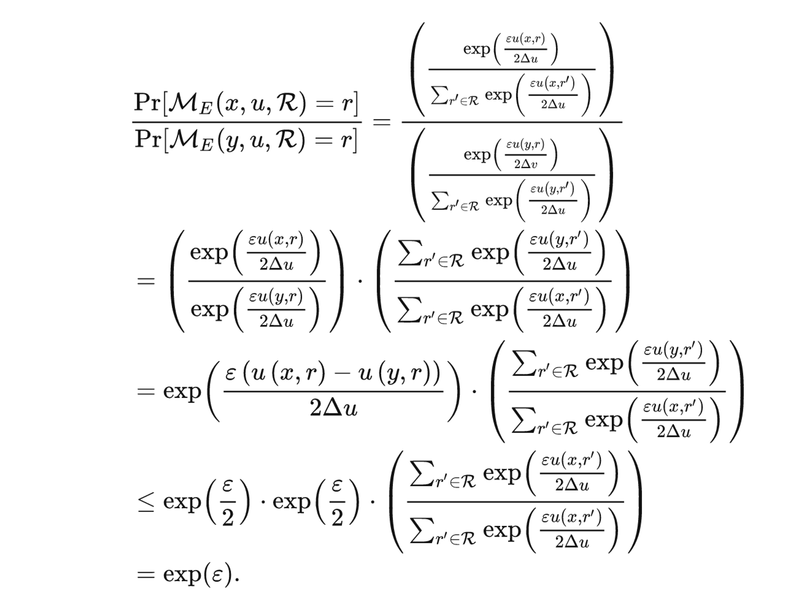
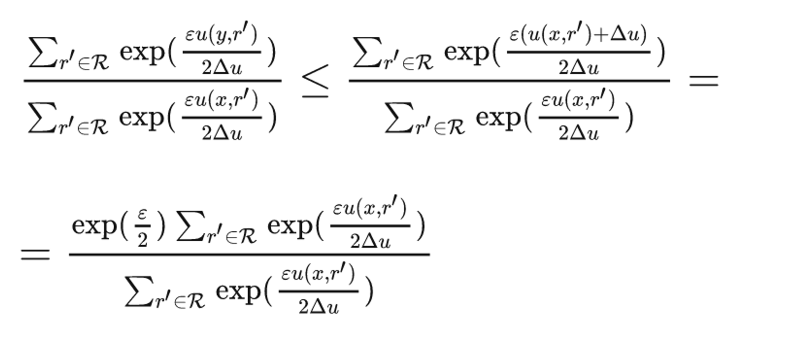

# 一、前言

1. 信息技术的发展，对数据集的研究成为了各个领域的关键，数据成为了最重要和基础的资源，数据的**发布、共享、分析**成为了一个热门的话题；

2. 数据集中往往包含了诸多的隐私，隐私会随着数据的发布而被泄露。保护隐私，就是要使得**任何用户访问数据库的过程中无法获取关于任何个体的确切信息**。

3. “K-匿名”方法被提出，通过**分组**的方式，在进行**压缩、泛化**等一系列处理后，**将所有记录划分到若干等价类中**，从而将单个记录隐藏在一整个类中。

4. “K-匿名”方法存在两个问题：①**攻击者所掌握的背景知识难以定义**，总是因为出现新型的攻击方式而不断更新；②**无法对隐私保护水平进行定量分析**，从而也就无法用严格的数据来评估保护方法的能力。

5. “差分隐私”方法被提出，相比“K-匿名”方法，存在两个特点：①**假设攻击者能够掌握除了攻击目标之外的所有背景知识**，默认以最恶劣的环境来处理问题；②对隐私保护进行了严格的定义，并**提供了量化评估的方法**。

# 二、差分隐私保护模型

## 2.1 相关概念

- **目标**：对两个“只有一个记录不同”的数据集进行查询访问，同一查询在两个数据集上产生相同结果的概率的比值接近于1。

- **邻近数据集**：两个数据集D和D'拥有相同的属性结构，两者的对称差记作集合D $\Delta$ D'，|D $\Delta$ D'|=1，则D和D'为邻近数据集。

## 2.2 差分隐私

【**定义**】

        设有随机算法M，$P_m$ 为M所有可能的输出构成的集合。对于任意两个临近数据集 D 和 D' 以及 $P_m$ 的任何子集 $S_m$，若算法M满足如下条件，则称算法M提供“ε-差分隐私保护”，其中参数 $\epsilon$ 称为隐私保护预算。

$$
P_{r}[M(D)\in S_{m}]\leq e^{\epsilon}×P_{r}[M(D')\in S_{m}]

$$

【**推导**】

        首先，给定事件 x，有两种不同的分布：

$$
p(x)或q(x)

$$

        以p(x)为例，取对数，再加上符号保持结果为正：

$$
I(p)=-ln \space p(x)

$$

        I(p)表示分布p蕴含的信息。显然，概率越大，包含的信息就越少；概率越小，包含的信息就越多。利用这一基本理念，我们可以计算其“香农熵”H(p):

$$
H(p)=E_{x\sim P}[I(p)]=\sum p(x)I(p)=-\sum p(x)ln \space p(x)

$$

        熵就是信息的均值，而在概率分布中，n“均值”就是“期望”，所以对信息值和概率密度函数求积分，即得香农熵。同理，我们可以求p在I(q)上的交叉熵：

$$
H(p,q)=E_{x\sim P}[I(q)]=\sum p(x)I(q)=-\sum p(x)ln \space q(x)

$$

        我们的目标是使得“同一查询在两个数据集上产生相同结果的概率的比值接近于1”，即产生不同结果的概率尽可能低。将相对熵的推导升阶：

$$
D_{KL}(p||q)=H(p,q)-H(p)=E_{x\sim P}[ln\frac{p(x)}{q(x)}]

$$

        这个式子的意义在于：相对熵是两个不同分布“相除后所取的对数”的均值。也即，对于单个值，他们中间的相对信息差距应该是用 $ln\frac{p(x)}{q(x)}$ 来计算的。

        根据“差分隐私”的定义，同一查询在两个数据集上产生相同结果的概率的比值接近于1，反过来，那就是产生不同结果的概率尽可能小，也就是$ln\frac{p(x)}{q(x)}$尽可能小。

        我们使用ε来把这个值框住，将字母替换为题设字母：

$$
max_{S \subseteq D}[ln\frac{p(x)}{q(x)}]\leq \epsilon

$$

        将ln变成e的格式，就有：

$$
p(x)\leq e^{\epsilon}×q(x)

$$

$$
P_{r}[M(D)\in S_{m}]\leq e^{\epsilon}×P_{r}[M(D')\in S_{m}]

$$

        用D和D'的概率密度函数来替换p,q，两边再分别积分，就可以得到：

        推导结束。

【注意】

        “产生不同结果的概率”这个表示有很多种，例如|p(x)-q(x)|，ln(p(x)/q(x))……应该怎么选取是一个问题。因此这里通过对信息熵的推导，以可以代表“数据分布差异”的相对熵入手，反推得到应该使用$ln\frac{p(x)}{q(x)}$作为表示。对于事件x，产生相同结果，该值为0，没有差异；产生不同结果，该值不为0，只需要用ε盖住即可。

【如果该值为负，该怎么判定呢？】

        ~~一种可能的猜想是，临近数据集的分布近似，符合对称性的规律，所以只需考虑一半的情况即可。~~

## 2.3 隐私保护预算

        我们使用ε来表示**隐私保护预算**，ε 越小，保护的水平越高，但相对的，结果也不能反映出任何有关数据集的有用信息了。**安全性**和**可用性**不可兼得。

        根据之前的推导，我们是使用“**信息熵**”来表示差分隐私的，因此 ε 可以理解为**为了达到尽可能高的安全性而使得信息可用性降低到的水准**。这个结论并不难理解，根据相对熵的公式：

$$
D_{KL}(p||q)=H(p,q)-H(p)=\sum p(x)ln\frac{p(x)}{q(x)}

$$

        且有：

$$
max_{S \subseteq D}[ln\frac{P_{r}[M(D)\in S]}{P_{r}[M(D')\in S]}]\leq \epsilon

$$

        相对熵衡量两个分布之间的差别，而两个分布对于任一事件的差别都被ε限制住了，ε越小，相对熵越小，自然分布差别越小，安全性越高，可用性越小。

        可用性的降低还可以这样理解：**为了使得隐私保护提高，必须加强噪声，而噪声会使得数据的可用性能降低**。这样，“**预算”的概念又可以变为“可以施加的噪声量”**，每次对数据进行访问，就在预算中进行噪声添加，预算削减。而当预算变为0时，就没法进行有价值的分析了。

        原理上来讲，上述两者的分析是等价的。

## 2.4 敏感度

        从2.2.3可知，噪声加的越多，可用性越少；噪声越少，安全性越差。因此需要对“**加入噪声的量**”进行定量分析和判别，为此引入了“**敏感度**”这个值来分析。敏感度的定义为：**删除数据集中任一记录对查询结果造成的最大改变**，它包含了“**全局敏感度**”和“**局部敏感度**”两种类。

**<1>全局敏感度**

        **【定义】**设有函数 $f:D\rightarrow R^d$*，*输入为一数据集，输出为一d维实数向量。对于任意的邻近数据集D和D'，有：

$$
GS_f=\underset{D,D'}{max}||f(D)-f(D')||，

$$

        其中||f(D)-f(D')||为f(D)和f(D')的一阶范数距离。

        换而言之，**对任意一个数据集，改变数据集中的一项，求这个函数的输出所发生的变化的最大值。**

        **【问题】**全局敏感度是针对整个分布的，如果全局敏感度较大，需要往里面添加足量的噪声来掩盖，这样会让整体的可用性变差。而有的时候，**我们往往只需要更改一些局部的特性就足以了**，所以必须引入局部敏感度来辅助运算。

**<2>局部敏感度**

        **【定义】**设有函数 $f:D\rightarrow R^d$ 输入为一数据集，输出为一d维实数向量。对于给定的数据集D和它的任意邻近数据集D'，有：

$$
LS_f(D)=\underset{D'}{max}||f(D)-f(D')||

$$

         也就是说，局部敏感度是针对固定的数据集D的。通过一个一个比较它和它的邻近数据集，得出其局部敏感度。**这个过程其实就和攻击者的比较方式是一致的。**这样也就不难理解，全局敏感度和局部敏感度之间的关系为：

$$
GS_{f}=\underset{D}{max}(LS_{f}(D))

$$

        **【问题】**由于我们是**使用攻击者的思路来定义局部敏感度的**，所以如果直接应用局部敏感度，反而会**泄露数据集的敏感信息**，因此需要引入平滑上界来进行遮掩。

**<3>平滑上界**

        **【定义】**给定数据集D及其任意邻近数据集D'，函数f的局部敏感度为LS_{f}(D)，对于β>0，若函数 $S：D\rightarrow R$ 满足：

$$
S(D)\geq LS_{f}(D)且S(D)\leq e^\beta S(D')

$$

        则称S为函数f的局部敏感度的β-平滑上界。

        同样的，基于平滑上界，我们可以定义平滑敏感度：

$$
S_{f,\beta}(D)=\underset{D'}{max}(LS_{f}(D')×e^{-\beta |DΔD'|})

$$

## 2.5 组合性质

**性质1 序列组合性**

        设有算法M1，M2，……，Mn，其隐私保护预算分别为ε1，ε2，……，εn，那么对于同一数据集D，由这些算法构成的组合算法M(M1(D),M2(D),……,Mn(D))，提供（Σεi）-差分隐私保护。

        这种组合算法，预算为全体预算的总和。

**性质2 并行组合性**

        设有算法M1，M2，……，Mn，其隐私保护预算分别为ε1，ε2，……，εn，那么对于不相交的数据集D1，D2……Dn，由这些算法构成的组合算法M(M1(D1),M2(D2),……,Mn(Dn))，提供（max ε）-差分隐私保护。

        如果算法序列中，所有算法处理的数据集彼此不相交，那么预算为所有预算中最大值，也即隐私保护水平取决于算法序列中保护水平最差者。

## 2.6 实现机制

【定义】Laplace 机制

        向确切的查询结果中掺入服从拉普拉斯分布的随机噪声来实现差分隐私保护。给定数据集D，设有函数 $f:D\rightarrow R^d$ ，其敏感度为Δf，那么随机算法 $M(D)=f(D)+Y$ 提供 ε-差分隐私保护，其中Y~Lap(Δf/ε)为随机噪声，服从尺度参数为Δf/ε的拉普拉斯分布。

【证明】

        对于位置参数为0（关于原点对称）、尺度参数为b的拉普拉斯分布Lap(b)，它的概率密度函数为：

$$
p(x)=\frac{1}{2b}e^{-\frac{|x|}{b}}

$$

        设邻近数据集为D和D'，满足||D-D'||≤1。根据差分隐私的定义，对于任意一个输出域内的结果t，均要符合式子：

$$
P_{r}[M(D)=t]\leq e^{\epsilon}×P_{r}[M(D')=t]

$$

        令 $M(D)=f(D)+Y=t$，$Y=t-f(D)$，且Y符合拉普拉斯分布。

        我们将拉普拉斯分布的概率密度函数带入：

$$
p_{r}(M(D)=t)=p_r(Y=t-f(D))=\frac{ε}{2Δf}e^{\frac{-ε|t-f(D)|}{Δf}}

$$

        同理，对于D'，也有：

$$
p_{r}(M(D')=t)=p_r(Y=t-f(D'))=\frac{ε}{2Δf}e^{\frac{-ε|t-f(D')|}{Δf}}

$$

        两式相除：

$$
\frac{p_r(M(D)=t)}{p_r(M(D')=t)}=\frac{e^{\frac{-ε|t-f(D)|}{Δf}}}{e^{\frac{-ε|t-f(D')|}{Δf}}}=e^{\frac{ε(|t-f(D)|-|t-f(D')|)}{Δf}}

$$

        根据绝对值不等式 $|a|-|b| \leq|a-b|$，对上式进行放缩：

$$
\frac{p_r(M(D)=t)}{p_r(M(D')=t)} \leq e^{\frac{ε|f(D’)-f(D)|}{Δf}}

$$

        根据全局敏感度的定义：

$$
LS_f(D)=\underset{D'}{max}||f(D)-f(D')||

$$

        可以得出：

$$
|f(D')-f(D)|\leq Δf, \space e^{\frac{ε|f(D’)-f(D)|}{Δf}} \leq e^{ε}

$$

        即：

$$
\frac{p_r(M(D)=t)}{p_r(M(D')=t)} \leq e^{ε}

$$

        移项，再对概率密度函数在 $S\subseteq R^k$ 上进行积分，e^ε为常量不变，就可以得到：

$$
P_{r}[M(D)\in S_{m}]\leq e^{\epsilon}×P_{r}[M(D')\in S_{m}]

$$

        证毕。

        同理，对于向量事件t=t(t1,t2,...,tn)的情况，只需将

$$
P_{r}(M(D)=t)

$$

        转化为：

$$
P_{r}(M(D)1=t1) \cap P_{r}(M(D)2=t2)...P_{r}(M(D)n=tn)

$$

        概率分别相乘，体现到指数上就是分别相加，再利用绝对值不等式的性质，将累差转化为1阶范式距离，利用放缩与Δf相消，仍旧可以得到上式，结论不变。

        综上，我们证明了Laplace机制符合差分隐私的定义。

【定义】指数机制

        设随机算法M输入为数据集D，输出为一实体对象 $r\in Range$，q(D,r)为可用性函数，Δq为函数q(D,r)的敏感度。若算法M以正比于 $e^{\frac{εq(D,r)}{2Δq}}$的概率从Range中选择并输出r，那么算法M提供ε-差分隐私保护。

【推导】

        首先我们要明白，指数机制的含义是什么。在指数机制的定义中，我们引入了一个“可用性函数”，也可以将其称之为“utility function”，即“效用函数”。它定义了一种对于数据的查询方式。

        这种查询方式是有问题的，例如通过最大化效用函数与其他信息的组合，我们就可以推断出某个人的隐私。因此，反过来，如果让每个数据在算法M的处理之后，输出结果为效用得分更高的那种选择的话，暴露的隐私就尽可能地少了。这就是指数机制的含义：**以更可能高的概率，得到效用得分更高的输出**。

        其中，不等式的证法为：

# 三、总结疑问

## 3.1 判定值为负

        在“**2.2差分隐私保护模型**”部分中，推导差分隐私模型的步骤中，存在一个问题：【如果$ln\frac{p(x)}{q(x)}$为负，该怎么判定呢？】笔者的一种可能的猜想：临近数据集的分布近似，符合对称性的规律，所以只需考虑一半的情况即可。

## 3.2 概率密度函数与概率

        在 **“2.2差分隐私保护模型”** 部分中，在诸多的推导、证明步骤中均涉及到了“连续模型的概率密度函数”与“离散模型的单个事件概率”的泛化问题。这里需要详细展开说明一下两者之间的关系。

## 3.3 诸多模型的理解

        对于在数据发布和数据挖掘里面的诸多模型，理解和分析还需要进一步的、更加具体的理解，需要结合给出的文献以及具体的公式来进行推导和判定。目前只是粗略理解了它们的实现过程。
