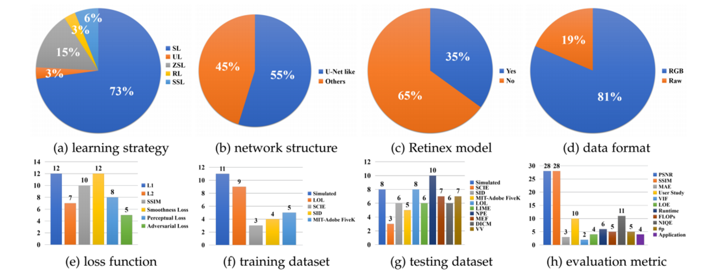
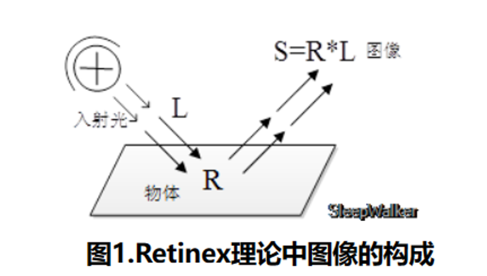
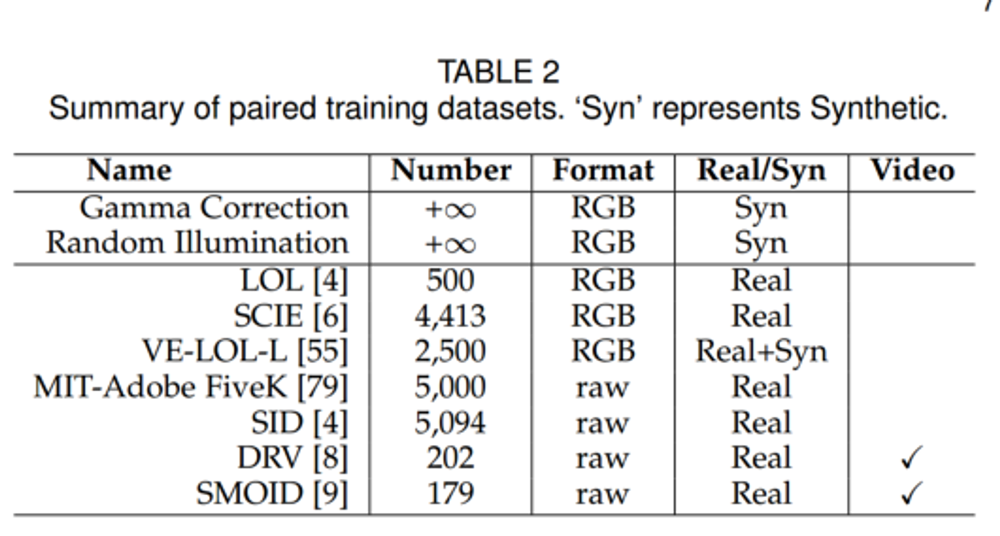
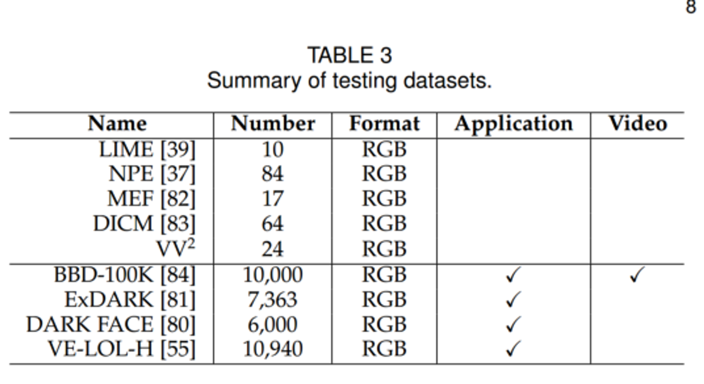

# 一、问题定义

图像域的空间设置为：$I \in R^{W*H*3}$，其中 W 表示宽度，H 表示高度，3 表示 RGB 三个通道。模型处理过程可以被抽象为：

$$
\hat{R}=F(I,\theta)

$$

这里，$\hat{R}$ 表示增强处理后的结果，$F$ 代表了在可训练参数 $\theta$ 上进行处理的网络。模型训练的目的是找到最优的网络参数，使得下式的结果最小：

$$
\hat{\theta}=\argmin_{\theta}L(\hat{R},R)

$$

其中，R 表示基本事实，L 为驱动网络优化的损失函数。

# 二、训练策略

简单整理，LLIE 任务的模型可以分为：①监督学习；②强化学习；③无监督学习；④零次学习；⑤半监督学习

## 2.1 监督学习

可以进一步分为：

- 端到端：最初的设计

    - ① LLNet：采用稀疏堆叠去噪自动编码器的变种，来给低照度图像去噪、提亮。

    - ② MBLLEN：端到端多分枝增强网络，通过特征提取模块、增强模块、融合模块来实现。为了提高性能，还可以引入照明网络、融合网络和恢复网络。

    - ③ EEMEFN：包括两个阶段，多次曝光融合和边缘增强，前者采用 TBEFN 这样的多重曝光融合网络来估计两个分支中的传递函数，然后采用简单的评价方案对这两幅图进行融合，并通过细化单元对结果进行进一步细化。

- 基于深度 Retinex: 通常通过专门的子网络分别增强照度分量和反射率分量。

    - Retinex-Net：Decom-Net 用来将输入图像分割成和独立于光的反射量、结构感知的平滑照明；Enhance-Net 调整照明图来进行低照度增强

    - Lighten-Net：减少计算负担。只包含了四层，将低照度图像输入，估算照明图。基于 Retinex 理论，将输入图除以照明图，来获得增强图像。

    - KinD：开发三个子网络，用于层分解、反射率恢复、光照调整。

    - Progressive Retinex Network：解决忽略噪声的问题。IM-Net 估计照明，NM-Net 估计噪声水平。这两个网络以渐进机制工作，直到结果稳定。

- “显示数据”驱动：之前的方法会使用合成训练数据，导致在真实的弱光条件下表现出较差的泛化性。

    - A multi-exposure image dataset (Cai et al.)：①不同曝光水平的低对比度图像具有它们相应的高质量参考图像；②每个高质量的参考图像都是通过主观地从不同方法增强的13个结果中选择最佳输出而获得的；③在构建的数据集上分解网络，并通过两阶段结构分别增强高频层和低频层。

    - SID and DRV：SID 是一个真实的低照度图像数据集，然后训练 U-Net 来学习从微光原始数据到相应的长曝光高质量参考图像的映射。SID 的扩展是低照度视频数据集 DRV，它包含了静态视频和相应的长曝光实况。

    - SMOID：增强暗中物体的运动，设计了一个同轴光学系统来捕捉时间同步和空间对齐的（低照度，亮照度）对。SMOID 视频数据集包含动态场景，这是和 DRV 不同的地方。

    - SIDGAN：DRV 只有静态视频，SMOID 只有179个视频对，因此构建了 SIDGAN 来合成低照度视频。通过具有中间域映射的半监督双 CycleGAN 来生成动态视频数据。

## 2.2 强化学习

- DeepExposure：在没有配对训练数据的情况下，通过 DeepExposure 的强化对抗性学习来曝光照片。具体来说，首先根据曝光将输入图像分割成子图，对每个子图，基于强化学习的策略网络依次学习局部曝光。通过对抗性学习来近似奖励评估函数。最后，每个局部曝光被用来对输入进行修饰，从而获得不同曝光下的多个修饰图像。最终的结构是通过融合这些图像来实现的。

## 2.3 无监督学习

- EnlightenGAN：为了解决在配对数据上训练深度模型可能会导致过拟合和有限的泛化能力而提出。采用了一种注意力引导的 U-Net 作为生成器，并使用 全局-局部 鉴别器来确保增强的结果和正是真实的正常光图像一致。除了全局-局部的损失对抗之外，全局和局部的自特征保存损失对保持增强前后的图像内容也是稳定训练GAN的关键所在。

## 2.4 零样本学习

- 上述的这些方法存在泛化能力有限、训练不稳定的情况，因此零样本学习的思路被提出了。Zero-Shot 学习只从测试图像中学习增强。需要注意的是，在低级视觉任务中使用零样本学习的概念是为了强调该方法不需要成对或者不成对的训练数据，这和高级视觉任务中的定义是不一样的。

- ExCNet：首先使用网络来估计最适合输入图像的 S 曲线，然后使用引导滤波器将输入图像分离为基本层和细节层。通过所估计的 S 曲线来调整基本层。最后使用 Weber 对比度来融合细节层和调整后的基本层。

- RRDNet：用于曝光不足的图像恢复，通过迭代最小化专门设计的损失函数，将输入图像分解为照度、反射率和噪声。利用 Retinex重建损失、纹理增强损失和照明引导噪声估计损失的组合，来驱动零样本学习。

- Zero DCEL：将光增强公式化为图像特定曲线估计的任务，以低光图像为输入，并产生高阶曲线作为输出。这些曲线用于对输入的动态范围进行逐像素调整，以获得增强的图像。

## 2.5 半监督学习

- DRBN：首先在监督学习下恢复增强图像的线性波段表示，然后通过基于无监督对抗性学习的可学习线性变换重新组合给定波段来获得改进的波段表示。引入长短期记忆 LSTM 网络和在美学视觉分析数据集上预先训练的图像质量评估网络来扩展，实现了更好的增强性能。

## 2.6 困难总结

- 监督学习：①收集覆盖不同真实世界低照度条件的大规模配对数据集本身就不容易；②合成的图像不能准确地表示真实世界的照度条件，例如空间变化的光照和不同水平的噪声；③在配对数据上训练深度模型可能导致对具有不同照明特性的真实世界图像的有限泛化。

- 无监督/半监督学习：如何实现稳定的训练，避免颜色偏差，并建立跨领域新的关系，颇具挑战；

- 强化学习：设计有效的奖励机制和有有效稳定的训练，相当复杂；

- 零样本学习：当考虑颜色保持、伪影去除和梯度反向传播时，非参考损失的设计是相当重要的。

- 零、前置知识

## 2.7 理论补充

Retinex 理论主要的思想是：人感知到某点的颜色和亮度并不仅仅取决于该点进入人眼的绝对光线，还和其周围的颜色和亮度有关。Retinex = Retina(视网膜)+Cortex(大脑皮层)。如下图所示：

Retinex 理论的基本假设是原始图像 S 是光照图像 L 和反射率图像 R 的乘积，也就是：

$$
S(x,y)=R(x,y)*L(x,y)

$$

基于 Retinex 理论图像增强的目的，就是从原始图像 S 中估计出光照 L，从而分解出 R，消除光照不均的影响，以改善图像的视觉效果。在处理的时候，通常将图像转至对数域，从而将乘积关系转换为和的关系：

$$
log(S)=log(R*L)\rightarrow s=r+l

$$

Retinex 方法的核心就是估计照度 L，从 S 中估测 L 分量，去除 L 分量，得到原始分量 R。其中 f(x) 实现对于照度 L 的估计：

$$
l=f(s),r=s-f(s)

$$

比如最简单的 SSR 算法（Singal Scale Retinex），具体的步骤如下：

- 输入原始图像 s(x,y)和滤波半径范围 sigma；

- 计算原始图像高斯滤波后的结果，得到 S(x,y)；

- 按照公式，计算得到 Log(R(x,y));

- 将得到的结果量化为[0,255]范围的像素值，然后输出结果图像。

基于 Retinex 有诸多的衍生公式和算法，例如 MSR 和 MSRCR…主要的困境在于去除照度 L 的步骤里，有很多算法直接估计 r 分量，导致结果仍旧偏暗。

# 三、技术审查和讨论

## 3.1 网络结构

LLIE 中主要采用 U-Net 和 类U-Net 网络结构，这是因为 U-Net 可以有效地集成多尺度特征，并同时使用低级和高级特征。这样的特性对于实现令人满意的低照度增强是必不可少的。

网络结构在设计的时候需要考虑这些问题：

- 经历过几个卷积层之后，由于其像素值较校，极低的光照图像的梯度可能会在梯度反向传播过程中消失，这将降低增强的性能，并影响网络训练的收敛性。

- 类 U-Net 网络中，使用的 skip 连接可能会在最终结果中引入噪声和冗余特征。

## 3.2 深度学习和 Retinex 理论的组合

Retinex 理论还存在这样的问题：

- 基于 Retinex 的 LLIE 方法中，使用的“反射率是最终增强结果”的理想假设会影响最终结果

- 深度网路中的过拟合风险仍然存在，应仔细考虑如何提炼并过滤。

## 3.3 数据格式

RGB的数据格数占据了主导地位，因为这通常是智能手机的摄像头。原始（Raw）格式的数据只现定于部分传感器，但数据覆盖了更宽的色欲和更高的动态范围。

- 因此在原始数据上训练的深度模型，通常可以恢复清晰的细节和高对比度，获得更生动的颜色，假少噪声和伪影的影响，并提高低照度图像的亮度。

- 从不同模式的原始数据到 RGB 格式的平滑转换，这有可能结合 RGB 数据的便利性和 LLIE 原始高数据提高。

## 3.4 损失函数

在 LLIE 中，常用的损失函数包括了“重建损失函数”（Reconstruction Loss）、“感知损失函数”（Perceptual Loss）和“平滑损失函数”（Smoothness Loss）。除此之外，根据不同的需求，还可以有 color loss、exposure loss、adversarial loss …

- Reconstruction Loss：不同的重建损失函数有其优缺点，L2 损失倾向于惩罚较大的错误，而对于小错误进行容忍。L1 损失可以很好地保持颜色和亮度，这是因为错误可以被平等地加权衡量，而不用管局部的结构。SSIM 损失可以很好地保留结构和纹理。

- Perceptual Loss：感知损失，尤其是特征重建损失，被提出用来约束特征空间中类似于实况的结果。这个损失提高了结果的视觉质量，被定义为“增强结果的特征表示”和“相应的基本事实的特征”之间的欧几里得距离。特征表示通常在 ImageNet 数据集中预训练的 VGG 网络中提取。IS、FID 指标也有类似的操作。

- Smoothness Loss：为了去除增强结果中的噪声，或者保持相邻像素的关系，通常使用平滑度损失（TV Loss）来约束增强结果或估计的照明图。

- Adversarial Loss：为了鼓励增强的结果和参考图像的相似性，优化了 MAX-MIN 问题（也就是GAN）。

- Exposure Loss：作为关键的非参考损失，测量在没有配对或未配对图像作为参考图像的情况下增强结果的曝光水平。

## 3.5 训练数据集

## 3.6 测试数据集

## 3.7 评估指标

PNSR（越大越好）、MSE（接近0越好）、MAE（越小越好）、SSIM（越接近1越好）、LOE（越小，明度顺序保存的越好）。

- 尽管存在上述这些经典的指标，但并不能完全捕捉人类的真实视觉感知；

- 一些指标最初并不是为低照度图像设计的，而是为了评估图像的保真度和对比图，不是低照度增强的目的；

- 除了LOE之外，缺乏专门为低照度图像设计的度量；

- 期望能够平衡人类视觉和机器感知的度量。

# 四、基准测试和实证分析

参与测试的模型：

监督学习：LLNet、LightenNet、Retinex-Net、MBLLEN、KinD、KinD++、TBEFN、DSLR

无监督学习：Enlight-enGAN

半监督学习：DRBN

零样本学习：ExCNet、Zero-DCE、RRDNet
