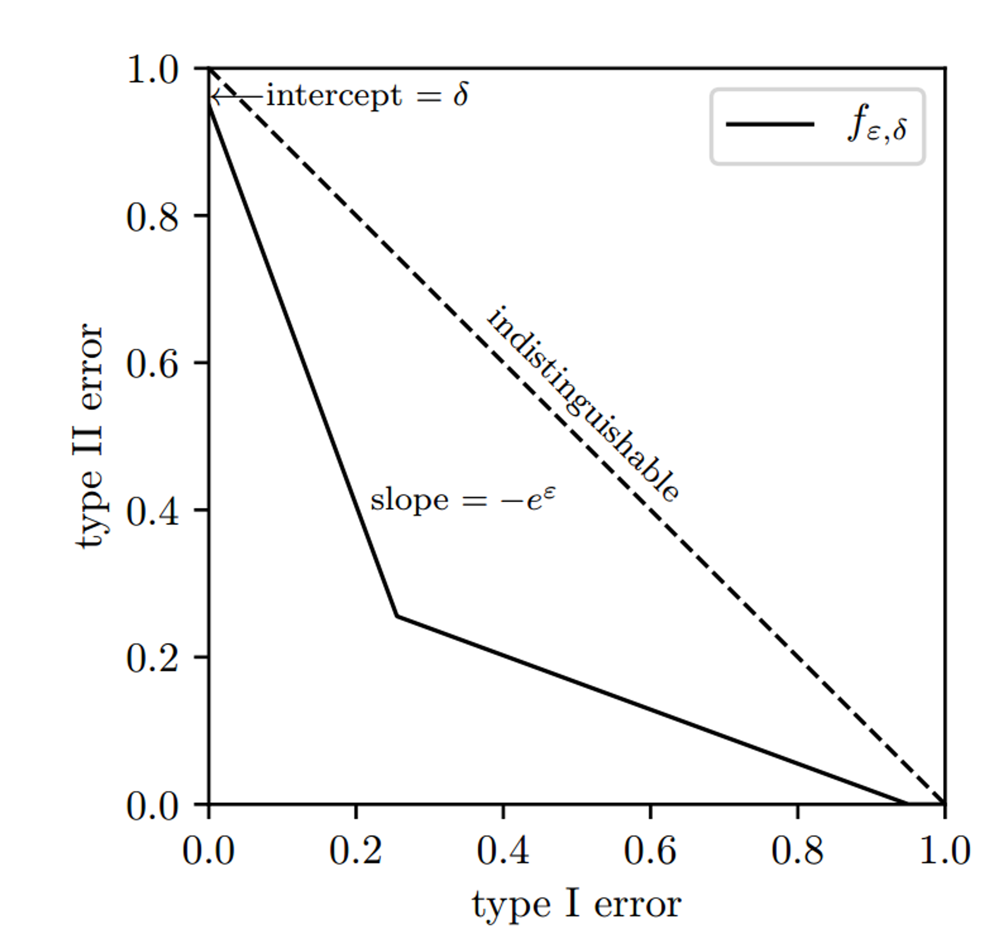

# 一、论文概述

        本文是 $f-dp$ 的一个应用实例，利用 $\mu-GDP$ 的高斯机制来代替以往 DP 训练中的 $Moment Accountant$ 或者 $Renyi Accountant$  这些组合方法，进而通过实验来分析 $\mu-GDP$ 的优势。

        这篇笔记主要关注的点在于：

- $\mu-GDP$  的运用流程和计算方式

- $\mu-GDP$ 和 $(\epsilon,\delta)-DP$ 在表达隐私预算和更新隐私成本时的异同点、相互转化的可能性

- $\mu-GDP$ 和 $(\epsilon,\delta)-DP$ 的效用差距，造成这些差距的分析方法

-

# 二、$f-DP$ 回顾

        这一部分主要关注 f-dp 在实际的模型构件中，主要运用到了哪些性质和知识点。简单来说，主要包括了以下这几点：

- $f-DP$ 定义的介绍： $T(M(S),M(S’))\geq f$, $其中：T(P,Q)=inf_{\Phi}\{\beta_\Phi:\alpha_\Phi\leq \alpha\}$

- $f-DP$ 和 $(\epsilon,\delta)-DP$ 的转化：$f_{\epsilon,\delta}(\alpha)=max{0,1-\delta-e^\epsilon\alpha,e^{-\epsilon}(1-\delta-\alpha)}$

- $\mu-GDP$ 高斯机制的引入：$G_\mu := T(N(0,1),N(\mu,1)),\;\;G_\mu(\alpha)=\Phi(\Phi^{-1}(1-\alpha)-\mu),\;\;

T(M(S),M(S'))\geq G_\mu$

- $\mu-GDP$ 添加高斯噪声：$N(0, \sigma^2),其中：\sigma=sens(\theta)/\mu,\;\; with \;sens(\theta)=sup_{S,S’}|\theta(S)-\theta(S’)|$

- 组合机制和中心极限定理：$f_1 \otimes f_2…\otimes f_T \rightarrow G_\mu$，其中 $\mu$ 是由和权衡函数相关的一系列参数构成

- 对称性和优化：权衡函数采用 $min\{f_p\, f_p^{-1}\}$**

# 三、算法和隐私分析

## 3.1 Noisy SGD

        令 $\theta$ 表示神经网络的参数，$l(\theta,x)$ 是损失函数，$t$ 是迭代代数，$I_t$ 是以概率 $p$ 从 ${1，2，…，n}$ 中抽取的最小的 $batch$ 数，规模为 $pn$。SGD算法有：

$$
\theta_{t+1}=\theta_t-\eta_t·\frac{1}{I_t}\sum_{i\in I_t}\nabla_\theta l(\theta_t,x_i)

$$

        接下来对一些参数进行说明：

- 算法的步骤中，首先要对梯度进行裁剪，然后再往裁剪的梯度上添加高斯噪声，相当于对更新后的迭代应用高斯机制。这个步骤将梯度的更新范围限定在了 R 以内，因而灵敏度为 R。

- 添加的噪声为 $\sigma R · N(0,I)$，根据高斯分布的性质，相当于 $N(0,(\sigma R)^2 I)$。根据 [上篇文章的 4-3 处的描述](https://www.notion.so/Gaussian-Differential-Privacy-369f5785706d4b788f68f06f7deaeed0?pvs=21) ，机制 M 符合 。

- noisySGD 符合 $min\{f,f^{-1}\}^{**}-DP$，其中 $f=(pG_{1/\sigma}+(1-p)Id)^{\otimes T}$。经历 T 次迭代后，根据中心极限定理，我们可以用一个 $\mu-GDP$ 来逼近它。也即：

$$
f=(pG_{1/\sigma}+(1-p)Id)^{\otimes T}\rightarrow G_\mu
$$

- 当 $T \rightarrow \infin$ 时，$p\sqrt{T} \rightarrow \nu,$  则 $\mu = \nu\sqrt{e^{1/\sigma^2}-1}$，有：
  
  $$
  min\{f,f^{-1}\}^{**}\rightarrow min\{G_\mu,G\mu^{-1}\}^{**}=G_\mu^{**}=G_\mu
  $$

- 根据 $p = \frac{B}{n}$，故最后：noisy-SGD 应该符合 $\frac{B}{n}\sqrt{T(e^{1/\sigma^2}-1)}$

        算法如下所示：

---

Algorithm 1 NoisySGD

---

- Input: Dataset  $S = \{ x_1,…,x_n \}$, loss function  $l\{\theta, x\}$

- Parameters:

    - initial weights $\theta_0$,

    - learning rate $\eta_t$ ,

    - subsampling probability p,

    - number of iterations T,

    - noise scale $\sigma$,

    - gradient norm bound R.

- for $t = 0,…,T-1$ do

    - Take a Poisson subsample $I_t \subset \{1,…,n\}$  with subsampling probaility p

    - for $i \in T_t$ do

        - $\nu_t^{(i)} \leftarrow \nabla_\theta l(\theta_t,x_i)$

        - $\overline{\nu}_t^{(i)} \leftarrow \nu _{t}^{i}/max\{ 1, ||\nu _t^{(i)}||_2/R \}$

    - $\theta_{t+1}\leftarrow \theta_t-\eta_t·\frac{1}{|I_t|}(\sum_{i\in I_t}\overline{\nu}_t^{(i)}+\sigma R·N(0,I))$

- Output $\theta_T$

---

## 3.2 和 Moment Accountant 的比较

        首先证明如下的引理：

        当 $T \rightarrow \infin$ 时，$p\sqrt{T}$ 收敛于一个正常数，那么不论是 NoisySGD 还是 NoisyAdam，都符合：

$$
\lim _{T\rightarrow \infin}\sup(\sup_{\epsilon \geq 0}f_{\epsilon, \delta_{MA}(\epsilon)}(\alpha)-G_{\mu_{CLT}}(\alpha))\leq0

$$

        这里需要强调的一点是，在 $(\epsilon,\delta)-DP$ 的框架下，$\epsilon$ 越小，那么隐私保护越强。但在 $f-dp$ 中相反， $f$ 越小，隐私保护越差。而在 $\mu-GDP$ 中，$\mu$ 越小，隐私保护越好。我们来看这样一张图：

- 实线部分为等效的 $(\epsilon,\delta)-DP$ 。可以看出，$\delta$ 越小，横纵截距越小，整体的图像越靠近右上方，I 类错误固定时，II 类错误越大；而 $\epsilon$ 关系到斜率，$\epsilon$ 越小，斜率越缓，整体的图像越靠近右上方，I 类错误固定时，II 类错误越大；整体上，$\delta$ 和 $\epsilon$ 越小，隐私保护水平越高。

- $f-dp$ 框架下，f 越小，表示图像越靠近左下方，I 类错误固定时，II 类错误越小，体现就是隐私保护水平越差。

- $\mu-GDP$ 框架下，等效于 $T(N(0,1),N(\mu,1))$，$\mu$ 越小，越难分辨，隐私保护水平越高。

        在上面的引理中涉及到了  $(\epsilon,\delta)-DP$ 和 $\mu-GDP$。而对于 $\mu-GDP$，可以转化为对应的 $(\epsilon,\delta(\epsilon;\mu))-DP$，其中：

$$
\delta(\epsilon;\mu)=1+G_\mu^*(-e^\epsilon)=\Phi(-\frac{\epsilon}{\mu}+\frac{\mu}{2})-e^\epsilon\Phi(-\frac{\epsilon}{\mu}-\frac{\mu}{2})

$$

        通过这个式子，我们可以把 $\mu-GDP$ 转化为对应的 $(\epsilon,\delta)-DP$，通过比较 $\epsilon$ 和 $\delta$ 也就可以直观地比较隐私保护程度的大小了。

        一般来讲，我们有：

$$
\lim_{T\rightarrow \infin} sup(\delta_{CLT}(\epsilon)-\delta_{MA}(\epsilon))<0,\;for\;all\;\epsilon\;>0\\

\lim_{T\rightarrow \infin}sup(\epsilon_{CLT}(\delta)-\epsilon_{MA}(\delta))<0,\;for\;ant\;\delta \;\;\;\;\;\;

$$

        当然，我们也可以反过来，通过上面的式子，给定 $\epsilon$ 和 $\delta$，求出对应的 $\mu$，从而在 $\mu-GDP$ 的框架下进行比较。

# 四、相关的推理证明

## 4.1 邻近数据集的分辨难度

【论点】：如果机制 M 是 $f-DP$, 并且 $S‘ = S \cup {x_0}$，那么有：

$$
T(M) \circ Sample_p(S),M\circ Sample_p(S'))\geq pf+(1-p)Id

$$

【证明】：我们可以用一个向量 $\vec{b}=(b_1,…,b_n)\in \{0,1\}^n$ 来表示第 i 个数字是否被选中。根据这个向量的情况，给出从 S 中采样的子集 $S_{\vec{b}}\subset S$。这里面每个 $b_i$ 都以概率 p 表示被选中，同时以 $Sample(S)$ 表示 $S_{\vec{b}}$。我们用 $\theta_{\vec{b}}$ 表示 $\vec{b}$ 出现的概率。不失一般性，假设 $\vec{b}$ 的 n 个规模中有 k 个为1，那么可以写成：$\theta_{\vec{b}} =  p^k(1-p)^{n-k}$。这样，我们可以写出：

$$
M \circ Sample_p(S)=\sum_{\vec{b}\in\{0,1\}^n}\theta_{\vec{b}}·M(S_{\vec{b}})

$$

同理，对于其邻近的数据集  $S' = S\cup x_0$，可以写成一个混合的表达式，也即：包含了 $x_0$ 和 不包含 $x_0$ 的两种情况：

$$
M\circ Sample_p(S')=\sum_{\vec{b}\in \{0,1\}^n}p·\theta_{\vec{b}}·M(S_{\vec{b}}\cup\{x_)\})+\sum_{\vec{b}\{0,1\}^n}(1-p)·\theta_{\vec{b}}·M(S_{\vec{b}})

$$

接下来我们借助一个引理，来证明该式子：

【引理】令 $I$  是一个索引集合。对于所有的 $i \in I$, $P_i$ 和 $Q_i$ 是在同一个域的分布。$(\theta_i)_{i\in I}$ 是一个非负数字的集合，和为1。如果 f 是一个 trade-off 函数，并且有 $T(P_i,Q_i)\geq f$，那么：

$$
T(\sum \theta_iP_i,(1-p)\sum\theta_iP_i+p\sum\theta_iQ_i)\geq pf+(1-p)Id

$$

如果该引理成立，那么自然令 $\vec{b}\in\{0,1\}^n$, $P_i$ 为 $M(S_{\vec{b}})$, $Q_i$ 为 $M(S_{\vec{b}}\cup\{x_0\})$，$T(P_i,Q_i)\geq f$ 是 一系列的符合 $f-DP$ 的 M 机制，那么上述的引理自然就可以化为：

【引理的证明】令 $P = \sum \theta_i P_i$，$Q=(1-p)\sum\theta_i P_i+p\sum\theta_i Q_i$。令 $\Phi$ 表示拒绝的规则，和原论文中的定义保持一致，那么有：$E_P\Phi=\alpha$，也就是：

$$
T(M) \circ Sample_p(S),M\circ Sample_p(S'))\geq pf+(1-p)Id

$$

$$
\sum\theta_iE_{P_i}\Phi=\alpha

$$

那么 Q 便可以写成：

$$
E_{Q}\Phi = (1-p)\alpha+p\sum\theta_iE_{Q_i}\Phi

$$

根据定义，$T(P_i,Q_i)\geq f$，而 $T(P_i,Q_i)(\alpha)=inf\{\beta_\Phi:\alpha_\Phi\leq\alpha\}$，$\beta_\Phi=1-E_Q[\Phi]$，因此：$E_{Q_i}\Phi \leq 1-f(E_{P_i}\Phi)$，也即：

$$
\sum\theta_iE_{Q_i}\Phi\leq1-\sum\theta_if(E_{P_i}\Phi)

$$

根据琴生不等式，对于属于凸函数的trade-off函数，有：

$$
\sum\theta_if(E_{p_I}\Phi)\geq f(\sum \theta_iE_{P_i}\Phi)=f(\alpha)

$$

则：

$$
E_{Q}\Phi\leq(1-p)\alpha+p(1-\sum\theta_if(E_{P_i}\Phi))\leq(1-p)\alpha+p(1-f(\alpha))

$$

根据定义，$T(P_i,Q_i)(\alpha)=inf\{\beta_\Phi:\alpha_\Phi\leq\alpha\}$，$\beta_\Phi=1-E_Q[\Phi]$，显然，$E_Q[\Phi]$ 取上限值，$\beta_\Phi$ 便可以取得下限值。而根据上式，$E_Q[\Phi]$ 的上限不会大于 $(1-p)\alpha+p(1-f(\alpha))$，也就是说：

$$
T(P_i,Q_i)(\alpha)\geq1-(1-p)\alpha-p(1-f(\alpha))=(1-p)(1-\alpha)+pf

$$

又有 $1-\alpha = Id$，所以：

$$
T(\sum \theta_iP_i,(1-p)\sum\theta_iP_i+p\sum\theta_iQ_i)\geq pf+(1-p)Id

$$

引理证毕！这个式子说明了子采样会如何影响最终的隐私保护（子采样在这个式子里以 p 的方式呈现）。

## 4.2 NoisySGD 隐私分析

【结论】算法符合 $\{f,f^{-1}\}^{**}-DP$，其中：

$$
f=(pG_{1/\sigma}+(1-p)Id)^{\otimes T}

$$

【证明】首先，根据原 Gasussian Differential Privacy 的论文，我们可以得到如下的一个引理：

---

【引理】假设 $M_1：X\rightarrow Y, M_2：X\times Y\rightarrow Z$，并且对于 $S$ 和 $S'=S\cup \{x_0\}$，满足以下两个条件：

- $T(M_1(S),M(S’))\geq f$

- $T(M_2(S,y), M_2(S’,y))\geq g, \;for\;any\;y\;\in Y$

那么，对于组合 $M_2\circ M_1$：$X\rightarrow Y\times Z$ 满足：

$$
T(M_2\circ M_1(S),M_2\circ M_1(S'))\geq f\otimes g

$$

---

继续上面的证明：

由 4.1 的分析证明，NoisySGD 算法可以理解为：

$$
NoisySGD:X^n\rightarrow V\times V...V\\

S\rightarrow (\theta_1,\theta_2...,\theta_T)

$$

上述的这个过程，就是 T 个 M 机制的组合。因此有：

$$
T(NoisySGD(S),NoisySGD(S'))\geq(pG_{1/\sigma}+(1-p)Id)^{\otimes T}=f

$$

需要注意的是，$T(NoisySGD(S),NoisySGD(S'))\geq f^{-1}$，这个关系也成立。

我们可以从这两个关系里得出：S 和 S‘ 的权衡函数的下界必然是 $f$ 和 $f^{-1}$ 中的一个。为了确保权衡函数的性质成立，这里取它们偏小值的双共轭函数，从而确保了凸函数性质。因此 得到算法符合 $\{f,f^{-1}\}^{**}-DP$。

