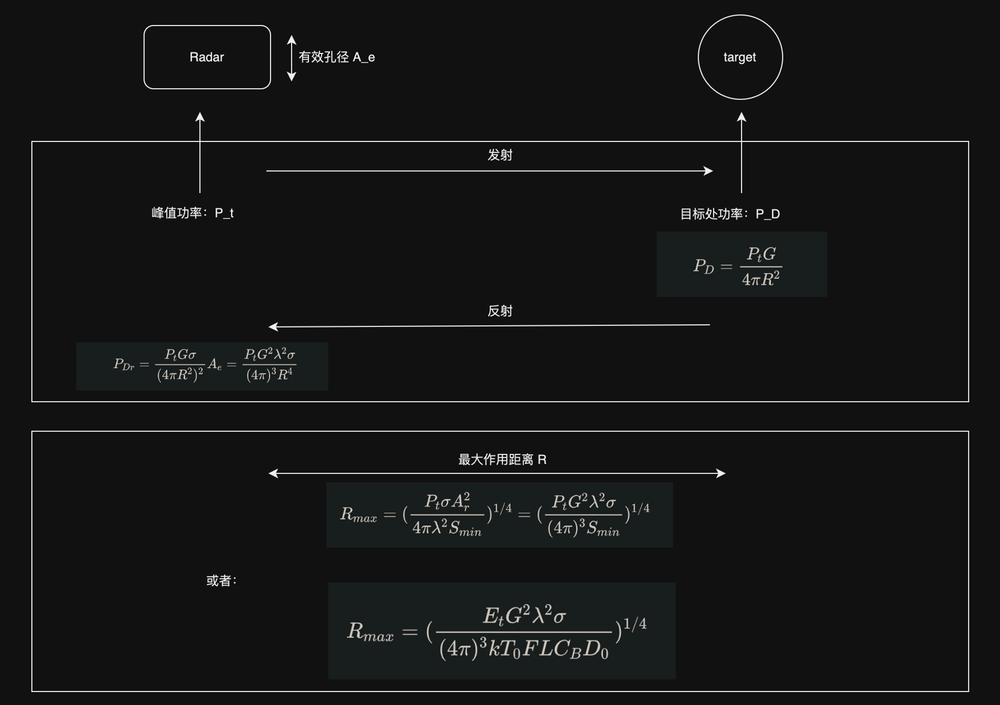

# 一、问题梳理

雷达相关的性能指标，大致上可以划分为如下五类：1、距离方程；2、信噪比 SNR；3、信干比 SJR （干扰方程）；4、特殊方程 （高低脉冲频率）；5、搜索方程 （宽仰角、堆积波束）

其中，SNR 和 SJR 是重要参量，影响着雷达的效用和精度；特殊方程和雷达的类型相关，搜索方程表征了雷达的工作模式，距离方程则表示了雷达的可用性。

## 二、雷达距离方程

这个过程是这样的：

- 雷达向周围的空间传播电磁场

- 电磁场获得定向天线的增益

- 到达目标后，在目标的表面产生感应电流，感应电流产生反射磁场

- 反射磁场被雷达接收到，根据前后磁场的功率、目标的雷达截面积，可以确定距离。

这个过程的推导需要注意的是对立体角和功率密度的推导。最终，我们可以得到雷达接收到的信号总功率和目标距离的四次方成反比。距离公式为：

$$
R=（\frac{P_t G^2 \sigma \lambda^2}{(4\pi)^3 P_{Dr}}）^{\frac{1}{4}}

$$

这个式子中的各参数意义如下：

| 参数        | 含义                                                                                      |
| --------- | --------------------------------------------------------------------------------------- |
| $P_t$     | 雷达的峰值功率                                                                                 |
| G         | 天线的增益，注意：$G=K\frac{4\pi}{\theta_\alpha \theta_e}$，这里面两个 $\theta$ 分别是天线方位以及仰角波束宽度        |
| $\sigma$  | 目标的雷达截面积，定义是“向雷达反射的功率密度”和“入射到目标上的功率密度”的比值，也就是：$\sigma=\frac{P_r}{P_D}$。                 |
| $\lambda$ | 波长，主要和雷达的有效孔径有关，$A_e=\frac{G\lambda^2}{4\pi}$                                           |
| $P_{Dr}$  | 这里是雷达接收到的信号总功率。算法是单位立体角内的反射功率和雷达立体角的乘积，也就是说：$P_{Dr}=P_r'*\frac{A}{R^2}$                 |
| $P_r'$    | 单位立体角内的反射功率，显然按照定义来说应该是：$P_r'=\frac{P_r}{4\pi}$，其中反射功率可以用 $\sigma$ 和 入射功率密度 $P_D$ 相乘得到， |
| $P_D$     | 入射到目标时雷达的功率密度，这里需要考虑天线的增益效果 G，$P_D=\frac{P_tG}{4\pi R^2}$                               |

一般来说，只有当雷达接收到的信号总功率大于某个最小的阈值的时候，雷达才能够稳定地发某个目标。确定这个阈值，那么我们就可以根据这个式子，得到最远的检测距离。

上面这个方程可以简单地划分成两类：

- 一类是雷达自身的相关属性，例如雷达的峰值功率、天线的增益、有效孔径、天线方位和仰角波束的宽度、电磁的波长。

- 另一类是被检测目标的属性，例如雷达截面积、反射功率。

也就是说，这个方程并没有考虑到周围的干扰因素，因而只能是一个理想方程。

## 三、SNR 条件下的雷达方程

如果我们考虑信噪比，那么情况就会变得不同起来。回顾上面的距离公式：

$$
R=（\frac{P_t G^2 \sigma \lambda^2}{(4\pi)^3 P_{Dr}}）^{\frac{1}{4}}

$$

除了 $P_{Dr}$ 之外，其他的参数都和雷达自身的性质有关。因此，考虑噪声，直接的影响因素就是雷达接收到的信号总功率，因此我们需要考虑雷达接收器的相关性质。

- 雷达的接收器具有一个参数“噪声系数”，它的定义是“输入信号的信噪比”和“输出信号的信噪比”的比值，也即：$F=\frac{(SNR)_i}{(SNR)_o}=\frac{S_i/N_i}{S_o/N_o}$

- 雷达的接收器的输入噪声功率，和雷达自身的工作带宽 B 有关：$N_i=kT_0B$

- 两式联合，可以得到接收器输入信号的公式：$**S_i=FN_i(SNR)=FkT_0B(SNR)_o**$

- 代入到距离公式里，显然当输出信号的信噪比取最小值时，距离R取到最大值，因此有：$R_{max}=（\frac{P_t G^2 \sigma \lambda^2}{(4\pi)^3kT_0BF(SNR)_{omin}})^{\frac{1}{4}}$，同理：$(SNR){omin}=\frac{P_t G^2 \sigma \lambda^2}{(4\pi)^3kT_0BFR{max}^4}$

- 再综合考虑雷达的损耗情况，我们可以用一个损耗因子 L 来表示，有：$(SNR){omin}=\frac{P_t G^2 \sigma \lambda^2}{(4\pi)^3kT_0BFLR{max}^4}$。这个物理量一般被叫做识别系数或者可见度因子 M，在现代雷达领域，检测目标信号所需的最小输出信噪比又称为检测因子 $D_0$

- 最后还剩一个带宽 B，一般情况下，可以认为带宽为时宽的倒数，也就是：$**B=1/\tau$。我们用信号能量**  $E_t=P_t\tau=\int_0^\tau P_tdt$ 代替脉冲功率，用检测因子 $D_0$ 代替 $( SNR )_{omin}$，再综合考虑接收器带宽失配所带来的信噪比损耗，在雷达距离方程中增加带宽矫正因子 $C_B\geq1$，那么雷达距离方程可以表达为：$**R_{max}=（\frac{E_t G^2 \sigma \lambda^2}{(4\pi)^3）kT_0FLC_BD_0)})^{\frac{1}{4}}**$

将整个步骤整理一下，如下所示：

在考虑 SNR 的过程中，涉及到了非常多的参数。我们将一、二两个部分的内容整合到一起，它们的表达方式和具体含义如下所示：

| 参数        | 含义                                                                               |
| --------- | -------------------------------------------------------------------------------- |
| $E_t$     | 信号能量，其值为：$E_t=P_t\tau=\int_0^\tau P_tdt$，是用 $B=1/\tau$ 替换掉 B 之后，和 $P_t$ 一起组合而成   |
| $G$       | 天线的增益，注意：$G=K\frac{4\pi}{\theta_\alpha \theta_e}$，这里面两个 $\theta$ 分别是天线方位以及仰角波束宽度 |
| $\lambda$ | 波长，主要和雷达的有效孔径有关，$A_e=\frac{G\lambda^2}{4\pi}$                                    |
| $\sigma$  | 目标的雷达截面积，定义是“向雷达反射的功率密度”和“入射到目标上的功率密度”的比值，也就是：$\sigma=\frac{P_r}{P_D}$。          |
| $k$       | 玻尔兹曼常数                                                                           |
| $T_0$     | 环境温度，一般取290开，也就是17摄氏度左右                                                          |
| $F$       | 雷达接收器的噪声系数，定义式为：$F=\frac{(SNR)_i}{(SNR)_o}=\frac{S_i/N_i}{S_o/N_o}$              |
| $L$       | 损耗因子，表达雷达的各部分损耗情况                                                                |
| $C_B$     | 带宽矫正因子，主要是接收器带宽失配所带来的信噪比损耗，一般大于等于1                                               |
| $D_0$     | 检测目标信号所需的最小输出信噪比，通常又叫检测因子，$( SNR )_{omin}$                                       |
| $B$       | 雷达的工作带宽，一般和时宽成反比，也就是：$B=1/\tau$                                                  |

可以发现，在综合考虑信噪比和环境的影响因素后，距离方程式变得复杂了很多。在这些影响因子中，我们也可以将其划分成三类：

- 和雷达自身属性相关：$E_t，G，\lambda，F，D_0，B，\tau$

- 和被探测的物体相关：$\sigma$

- 和大环境的影响相关：$T_0，L，C_B$

因此，我们往往需要运用挖掘和机器学习相关的知识，来拟合这些和大环境的影响相关的因子，通过实际的推理/实践流程，来矫正具体的参数情况。

# 四、雷达特殊方程

根据雷达的重复脉冲频率（PRF），雷达又可以划分成“低脉冲雷达”和“高脉冲雷达”两种。低PRF雷达，主要用于检测低速目标，在飞机、船只、降水观测等领域起着重要的作用，也可以用来对抗转发式干扰机或者同步式干扰机。高PRF雷达，可以用于空中拦截、火控系统、地基空中监视、武器定位雷达…

在考虑 PRF 的时候，有一个因子是绕不过去的，就是占空因子。考虑脉冲宽度为  $\tau$，脉冲的重复周期为 T，发射峰值功率为 $P_t$ 的脉冲雷达，则其平均发射功率为 $P_\alpha=P_td_t$。其中，$d_t = \tau/T$，这是雷达的发射工作比，也叫做发射占空因子。同样的，我们也可以定义接收占空因子：$d_r=\frac{T-\tau}{T}$。

## 4.1 低 PRF 雷达方程

对于低PRF的雷达而言，有 $T>>\tau$ ，因此接收占空因子趋近于1。对于信噪比的影响，只需要考虑低PRF的情况下，脉冲回波信号的相干积累即可。

- 设驻留时间为 $T_i$（波束照射目标的时间）：$T_i=n_p*T=\frac{n_p}{f_r}$，这里面 $n_p$ 为到达目标的脉冲总数，$f_r$ 是雷达的脉冲重复频率。

- 对于低PRF的雷达，单个脉冲的雷达方程不变：$(SNR){1}=\frac{P_t G^2 \sigma \lambda^2}{(4\pi)^3kT_0BFLR^4}$

- 对于n_p个目标脉冲回波信号进行相干积累，理论上比单个脉冲回波的信噪比提高 $n_p$ 倍，这时的方程会变为：$**(SNR)_np=\frac{P_t G^2 \sigma \lambda^2n_p}{(4\pi)^3kT_0BFLR^4}**$

- 优化 B 和 $n_p$：$**(SNR)_np=\frac{P_t G^2 \sigma \lambda^2 T_if_r\tau}{(4\pi)^3kT_0FLR^4}**$

随着脉冲数目的增加，低PRF的雷达在R相同的时候，信噪比会更高。随着距离的增加，当信噪比接近临界值D的时候，距离显然会更远，能够探测到更远距离的物体。

## 4.2 高 PRF 雷达方程

考虑高PRF的情形，这种情况下，通常使用中心线功率作为目标回波功率来计算信噪比，这是因为中心线保留在接收器中，而PRF线的回波被切除，对于匹配的发射-接收雷达系统，这两种SNR计算方法是完全等效的。

因此，考虑高PRF雷达：

- 单个脉冲回波的雷达方程为：$(SNR)=\frac{P_t G^2 \sigma \lambda^2 d_t^2}{(4\pi)^3R^4kT_0BFLd_r}$

- 这个情况下需要考虑接收占空因子 $d_r$，因为它的值和发射占空因子相当。事实上，有 $d_r \approx d_t=\tau f_r$（$f_r$ 是脉冲重复频率）。此外，考虑工作带宽和雷达积累时间相匹配，也即：$B= 1/T_i$，得到：$(SNR)=\frac{P_t \tau f_r T_i G^2 \sigma \lambda^2}{(4\pi)^3R^4kT_0FL}$

- 将 $P_a=\frac{\tau}{T}P_t = P_t\tau f_r$带入上式，有：$(SNR)=\frac{P_a T_i G^2 \sigma \lambda^2}{(4\pi)^3R^4kT_0FL}$

注意到 $P_aT_i$ 表示能量，这表示高 PRF 雷达可以通过相对较低的功率和较长的积累时间来增强探测性能。发射占空比的增加，探测性能也会接连改善。

## 4.3 特殊方程总结

雷达特殊方程针对的是不同PRF情况下的信噪比情况。高PRF，接收占空因子和发射占空因子相当，通常要用中心线功率作为回波功率来计算信噪比；低PRF，接收占空因子接近于1，只需要考虑多个脉冲回波信号的相干累积即可。

这里引入的因子相对来讲较少，主要包括以下这些方面：

| 参数         | 含义                                                                                                   |
| ---------- | ---------------------------------------------------------------------------------------------------- |
| $P_\alpha$ | 平均发射功率，表达式为：$P_\alpha=P_td_t$，其中，$d_t = \tau/T$。                                                     |
| $d_t$      | 发射占空因子，表示脉冲宽度在脉冲周期里的占比                                                                               |
| $\tau$     | 脉冲宽度                                                                                                 |
| $T$        | 脉冲的重复周期                                                                                              |
| $d_r$      | 接收占空因子，其表达式为：$d_r=\frac{T-\tau}{T}$                                                                  |
| $T_i$      | 驻留时间，也就是波束照射目标的时间，一般有：$B= 1/T_i$，和：$T_i=n_p*T=\frac{n_p}{f_r}$，其中 $n_p$ 表示到达目标的脉冲总数，$f_r$ 是雷达的脉冲重复频率 |

基本上都是和雷达自身属性相关的因素，和环境、干扰机制等等无关。

# 五、搜索雷达方程

## 5.1 搜索雷达方程介绍

常用的搜索雷达的波束探索模式共有两种，一种是宽仰角的模式，可以覆盖要求的搜索范围，而波束在方位维上扫描；第二种为堆积波束搜索，通常应用于相控阵雷达，需要在方位和仰角两维上时分波束扫描。如下图所示：

搜索空域通常由搜索立体角 $\Omega = \theta_A \theta_E$ （$\theta_A、\theta_B$ 分别为雷达在方位和仰角上的搜索空域范围）指定，单位为 sr（球面弧度），如下所示：

- 设天线在方位和仰角维的半功率波束宽度分别为  $\theta_\alpha, \theta_e$，天线波束所张的立体角为 $\beta=\theta_a \theta_e$，则需要覆盖立体角 $\Omega$ 的天线波束数量 $n_B$ 为：$n_B=\frac{\Omega}{\beta}=\frac{\Omega}{\theta_a\theta_e}$

- 限定扫描整个空域的时间为 $T_{sc}$，而天线波束扫过目标所在波位的驻留时间为 $T_i$，则有：$\frac{T_i}{T_{sc}}=\frac{\beta}{\Omega}$。所以驻留时间为：$T_i=\frac{T_{sc}}{n_B}=\frac{T_{sc}}{\Omega}\theta_a\theta_e$

由此可见： **当天线增益加大**时（波束变窄），一方面**使收发能量更集中，有利于提高作用距离**，但**同时天线波束宽度减小**，**扫过目标的驻留时间缩短**。可利用的脉冲数 M 减小，这又不利于发现目标。

根据三中的结论，对于基本雷达方程，有：

$$
(SNR)=\frac{P_a T_i G^2 \sigma \lambda^2}{(4\pi)^3R^4kT_0FL}

$$

假设在单次扫描内，每个波束只有一个脉冲照射目标，也即：$T_i=T$，代入上式，可以得到：

$$
(SNR)=\frac{P_a G^2 \sigma \lambda^2}{(4\pi)^3R^4kT_0FL}\frac{T_{sc}}{\Omega}\theta_a\theta_e

$$

一开始的时候说明了，天线增益 G 和有效孔径 A 之间的关系为：$G=(4\pi A_e)/\lambda^2$，且 $G=K\frac{4\pi}{\theta_a\theta_c}$，K取决于天线的物理孔径形状，这里取1，那么波束张角 $\beta$  和天线增益 G 的关系就变成了：$\beta=4\pi/G$, 那么搜索方程为：

$$
(SNR)=\frac{P_a A_e \sigma}{4\pi R^4kT_0FL}\frac{T_{sc}}{\Omega}

$$

式中 $P_aA_e$ 被称为功率孔径积。

假设雷达采用直径为 D 的圆形孔径天线，3dB 波束宽度为 $\theta_{3dB}\approx \lambda/ D$，扫描时间 $T_{sc}$ 与在目标上的驻留时间 $T_i$ 的关系为：

$$
T_i=\frac{T_{sc}\lambda^2}{D^2\Omega}

$$

则：

$$
(SNR)=\frac{P_a G^2 \sigma \lambda^2}{(4\pi)^3R^4kT_0FL}\frac{T_{sc}\lambda^2}{D^2\Omega}

$$

再次利用 $G=(4\pi A_e)/\lambda^2$

## 5.2 搜索方程总结

这里主要介绍的是雷达搜索方程相关的内容。我们在4.3 处已经讨论了高PRF情况下，SNR的表达方程。本节主要考虑的是该方程中的参数 $T_i$ 和雷达搜索方式的关系。主要是根据不同 $T_i$ 和 $T_{sc}$  的关系，来改写 SNR 的方程。

# 六、雷达干扰方程

## 6.1 雷达干扰器

电子对抗（ECM），就是指一切为了探测敌方无线电电子设备的电磁信息，进而削弱或破坏其使用效能所采取的技术措施的统称。干扰器大致上可以分为两大类：噪声阻塞式干扰器和欺骗式干扰器。

雷达接收机接收的目标回波信号和干扰的功率之比称为信干比（SJR）。当存在强干扰的时候，探测性能由接收的**信干比**和接收机**信噪比**共同决定。大多数情况下，探测能力只由信干比决定。

### 6.1.1 阻塞式干扰器

阻塞式干扰器试图增加在雷达整个工作带宽s内的噪声电平，从而降低了接收机的信噪比。由于噪声阻塞式干扰器辐射的信号遮住了目标回波，因此雷达难以检测到目标。因此，阻塞式干扰器又经常被称呼为——遮蔽器。

攻击方式上，阻塞式干扰器可以从雷达的主瓣或者副瓣方向进入雷达。如果从主瓣的方向进入，就可以利用天线的最大增益把干扰器发射的噪声功率放大；而从副瓣的方向进入，就必须使用更大的功率，或者工作在比主波干扰器更近的距离上。主波束阻塞式干扰器可布置在攻击的运载工具上，或者作为目标的护航者。副瓣干扰器通常对特定的雷达进行干扰。由于它们需要在靠近目标的地方，因而通常采用护航目标远距离布置的方案。

如下所示：

### 6.1.2 转发式干扰器

转发干扰器在战机上载有接收设备，用来分析雷达发射波形参数及其工作情况，然后发回类似于目标的虚假信号来干扰雷达。转发式干扰器主要有两类，点噪声转发干扰器和欺骗转发干扰器。

点噪声转发干扰器先估测雷达发射信号的带宽，然后仅在特定频率上进行干扰。由于不需要干扰整个雷达带宽，转发干扰器能够更充分地利用干扰功率。雷达频率捷变可能是战胜点噪声转发干扰器的唯一途径。

欺骗转发干扰器发回事的目标出现在虚假位置的信号，这些信号使得目标出现在一些虚假的位置。一个欺骗转发干扰器可以产生多个欺骗的假目标信号。

通常，干扰器可以用其有效工作带宽 $B_J$ 和有效辐射功率（ERP）来定义，后者与干扰器发射功率 $P_J$ 成正比。更准确地说：

$$
ERP=\frac{P_JG_J}{L_J}

$$

这个式子里，$G_J$ 是干扰器的天线增益，$L_J$ 是干扰器总损耗。$\frac{ERP}{B_J}$ 表示干扰器在干扰频带 B_J 的有效辐射功率谱密度。干扰器对雷达的效率用信干比（SJR）来衡量。

## 6.2 自屏蔽干扰器（SSJ）

也叫“自我保护干扰器”，通常被安装在了需要保护的飞机、舰艇等目标上。整个流程如下：

- 雷达从目标处收到反射的脉冲信号，功率为S

- 雷达从目标处收到自我保护器SSJ辐射的干扰信号，功率为J

- S和J的比值，得到雷达接收到的信干比：

$$
\frac{S}{J}=\frac{P_tG\sigma B_JL_J\tau}{4\pi R^2P_JG_JL}

$$

- 如果采用脉冲压缩，利用时宽带宽积：$G_{PC}=B\tau$，有：

$$
\frac{S}{J}=\frac{P_tG\sigma L_JG_{PC}}{4\pi R^2P_JG_JL}*\frac{B_J}{B}

$$

一般来说，信干比会小于1，这是因为干扰功率到达雷达，这个过程是单程的；而雷达目标回波包含发射、接收的距离，因此通常干扰功率会比目标信号功率大一点。也就是S会比J来的小。

令S=J，我们可以得到一个“烧穿距离”，或者“跨越距离”：

$$
R_{co}=[\frac{P_tG\sigma L_jG_{PC}B_J}{4\pi P_JG_JL B}]^{1/2}

$$

当干扰器和雷达的距离超过这个跨越距离时，干扰效果处于压制状态。换而言之，给定干扰功率和目标信号功率，烧穿距离就是干扰器能够对雷达保证压制的最小距离。

## 6.3 远距离干扰器

远距离干扰器（SOJ）主要从被干扰者的防御范围之外发射电子对抗。

G’ 代表在干扰器方向的雷达天线增益，通常认为是雷达的旁瓣增益。则经过脉冲压缩后，雷达接收的目标功率 S 和远距离干扰器辐射信号的功率 J 之比为：

$$
\frac{S}{J}=\frac{P_tG^2R_J^2\sigma B_JL_JG_{PC}}{4\pi P_JG_JG'R^4BL}

$$

同样，令 S=J，得到跨越距离为：

$$
R_{co}=(\frac{P_tG^2R_J^2\sigma B_JL_JG_{PC}}{4\pi P_JG_JG'BL})^{1/4}

$$

则检测距离为：

$$
R_D=\frac{R_{co}}{\sqrt{(S/J)_{min}}}

$$

## 6.4 雷达干扰方程总结

主要考虑了两种干扰的模式：一种是自屏蔽干扰，还有一种是远距离干扰，

自屏蔽干扰装备在被防御目标上，远距离干扰从防御范围之外发射电子对抗。处理过程主要涉及了信干比，当信干比为1时，可以得到跨越距离。这是在干扰器起压制效果的时候，被防御目标和雷达之间的最近的距离。
