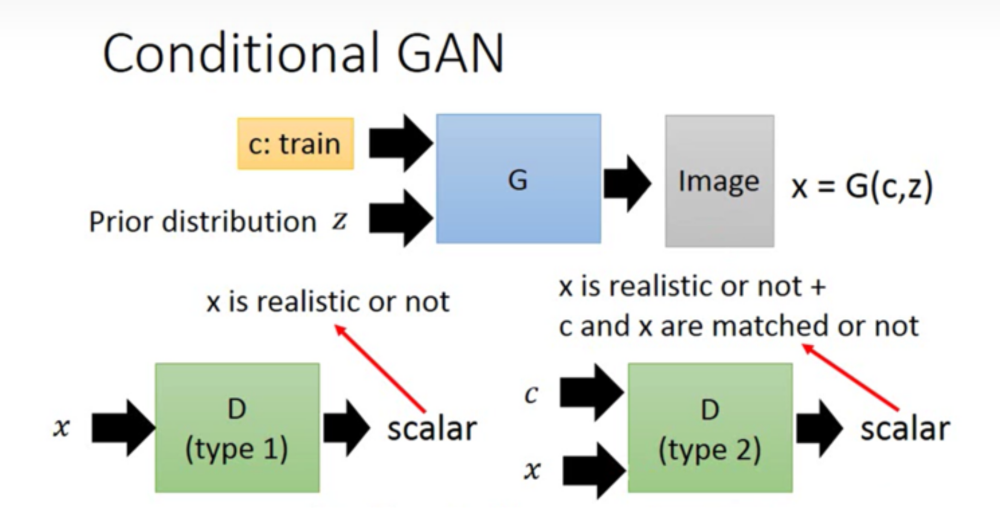
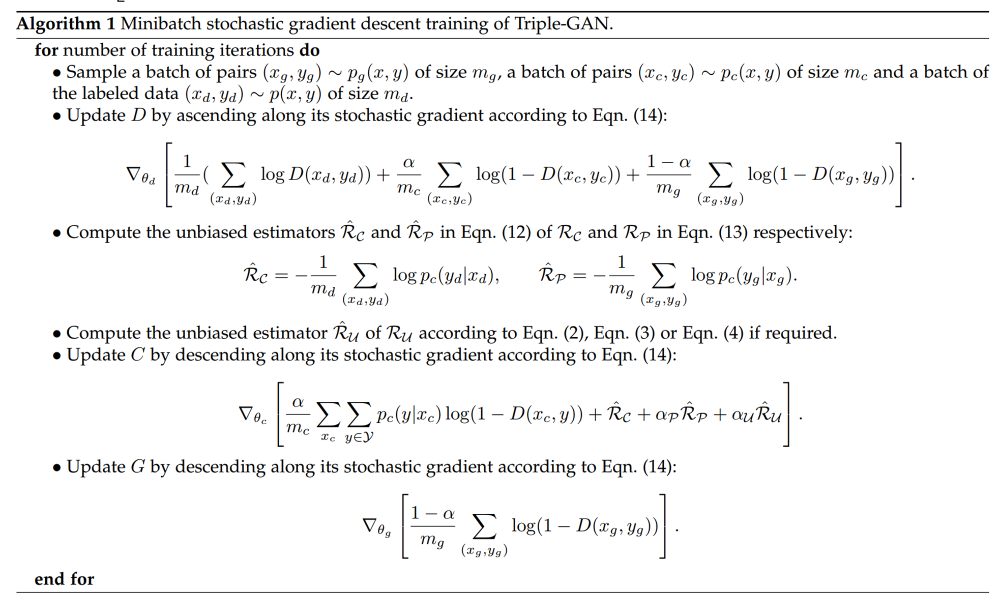
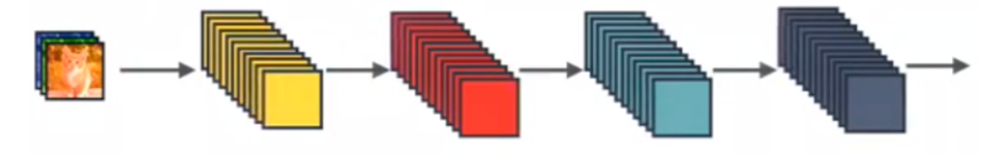
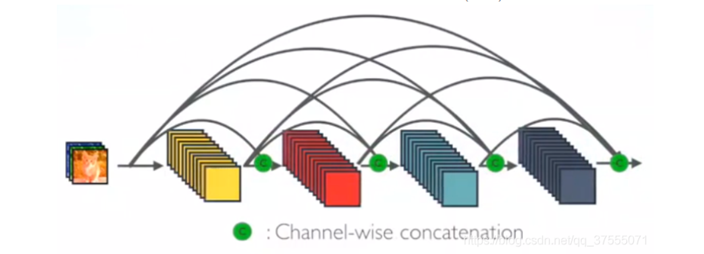
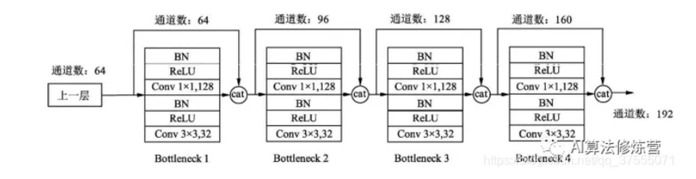
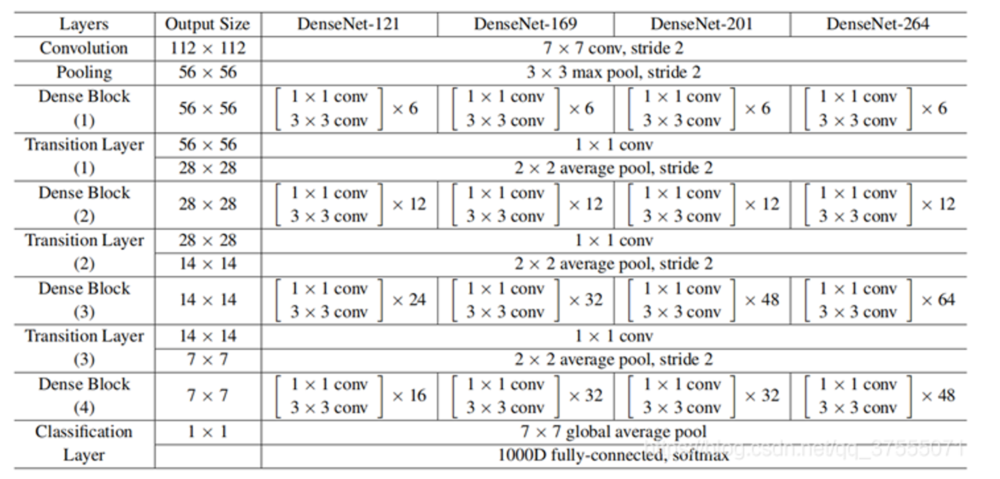
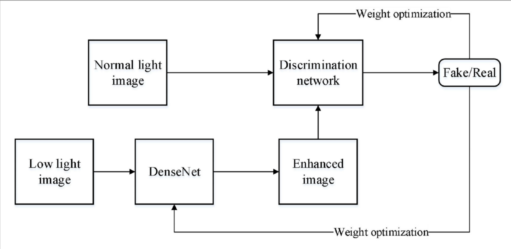
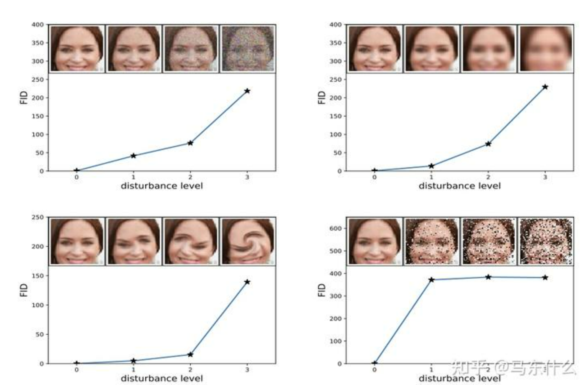

# 图像增强 — 基于 GAN 模型的算法

# 一、问题描述

首先对任务进行分类，大致可以分成如下四种任务：

- 评测模型的拟合成效：GAN 模型的评估技术；主要针对不同类的图像，分别评估拟合成效。因此需要在图像处理之余，考虑分类任务。

- 图像数据的增强模型：图像增强主要包括 ① 低照度图像增强；② 超分辨率；③ 色彩恢复；④ 图像修复；⑤ 交互式图像编辑

- 失真状态的质量评估：主要包括了 ① 图像的修复技术；② 失真图像的评估技术

- 进行图像数据的扩充：包括 ① 图像数据的扩充，生成更多相似的图像样本数据；② 图像信息的扩充。

我们可以据此给出一些初步的设计和模型类别：

- 评估拟合，可以考虑使用主流的 IS 和 FID 指标；

- 分类需求，使用 CGAN 或者 Triple-GAN 来实现；

- 增强模型，考虑超分辨率模型、色彩恢复模型和图像补足模型；

- 失真评估，VSI 和 PSNR、SSIM 和 MSE 等指标方法；

- 数据扩充，DCGAN，Triple-GAN

# 二、算法介绍

## 2.1 数据扩充模型

图像数据的扩充，主要是利用现有的数据生成新的、具备相似分布的数据，从而在样本数据比较小的情况下，获得足够的图像数据，用于给后续的分析任务进行处理。需要注意的是，这里需要考虑分类的情况，也就是算法应该考虑“生成带标签的数据”这种情况，这样才符合评估测试时“根据图像的不同类别进行拟合评估”的要求。

这一阶段，“带标签的数据扩充模型”主要包括：CGAN 和 Triple-GAN。

### 2.1.1 算法介绍

【CGAN】：也就是 Conditional GAN，将原生 GAN 中的概率全部替换为了条件概率：

$$
\min_G\max_D V(G, D)=E_{\textbf{x}\sim p_{data}(\textbf{x})}[log(D(\textbf{x}))]+E_{\textbf{z}\sim p_{z}(\textbf{z})}[log(1-D(G(\textbf{z})))]\\

\downarrow\\

\min_G\max_D V(G, D)=E_{\textbf{x}\sim p_{data}(\textbf{x})}[log(D(\textbf{x|y}))]+E_{\textbf{z}\sim p_{z}(\textbf{z})}[log(1-D(G(\textbf{z|y})))]

$$

需要注意的是，这个条件可以是图片、标注…因此，在生成带标签的数据时，这个条件就应该是标签数据了。

在 CGAN 的框架下，原本判别器 D 的任务是判别输入 X 是否为真，现在变成了：①判别 X 是否为真；②条件 C 和输入 X 是否匹配。流程如下所示：


算法层面的实现，就是将输入（例如图片）变成数据对或者元组（例如图片-标签），如下所示：

```latex
for epoch in range(num_epochs):

    for i, (images, labels) in enumerate(train_loader):

        # 训练判别器

        outputs = discriminator(images, labels)

        # 训练生成器

        z = torch.randn(batch_size, latent_size).to(device)

        fake_images = generator(z, labels)

        outputs = discriminator(fake_images, labels)
```

【扩展】CGAN 的条件 C 可以是图片、标注…因此，我们还可以利用 CGAN 来完成一些其他的任务，例如生成制定风格的图片；灰度图、轮廓图转换成真实图片…

【不足】CGAN 的训练本身需要标签，而带标签的、符合规范的数据，这本身就需要大量的人力来进行标注，是不太现实的。此外，也缺少相关的步骤来对训练过程进行约束，这使得训练结果存在不确定性。

---

【Triple-GAN】：在处理监督或者半监督学习的任务时，GAN 遇到了困境。一方面，我们希望鉴别器 D 应该无法分辨数据集的真伪，体现的是较高的信息熵值；而在另一方面，我们往往又希望分类的结果尽可能地真实，体现的是较低的信息熵值。这种矛盾使得 GAN 在处理类似的任务时，往往会陷入困境。同时为了处理 CGAN 需要大量标签数据的困境，Triple-GAN 的思路就被提出了。

Triple-GAN 算法的主要思路是，分离出一个分类器 Classifier，它和生成器 G 一起协作完成生成任务。对于 C，输入一个真实的数据，输出一个伪标签；对于 G，输入一个真实的标签，输出一个伪数据。最终以 (数据，标签) 对的形式，交付给 D 进行真假判别。它的损失函数如下：

$$
\mathop{min}\limits_{C,G} \;

\mathop{max}\limits_{D} \;

E_{P(x,y)}[log(D(x,y)]+\alpha

E_{P_c(x,y)}[log(1-D(x,y))]+(1-\alpha)E_{P_g(x,y)}[log(1-D(G(y,z),y))],\;\alpha\in(0,1)

\;\;\;\;\;\;

$$

Triple-GAN 重构了 GAN 的组成框架，因而需要考虑如下三个问题：

- D 的收敛性如何？

- 在训练的过程中，生成器 G 和鉴别器 C 的趋势如何，是否稳定？

- 如何确保 G 和 C 最终收敛到真实的分布上？

前两者，第一项可以通过转换损失函数求导解决，第二项可以通过构造类似JS散度的表达式，利用其对称性来解决。第三项，Triple-GAN 引入了两个 KL散度的等效式子，通过在 $P_c$ 和 $P_g$、$P_{data}$ 和 $P_c$ 这两对之间的优化，来使得 C 和 G 最终收敛到真实分布上。它的算法用伪代码表示如下：


### 2.1.2 算法适用性

- CGAN：

    - 【条件】有较多的带标签数据可以作为训练集来使用。

    - 【适用】生成类似分布的带标签数据，也可以用来生成特定风格的图片、或者将轮廓图、灰度图转化成真实风格的图片

- Triple-GAN:

    - 【条件】相比 CGAN，训练集的范围宽泛地多。在训练集不够多的时候，有较强的效用。

    - 【适用】生成类似分布的带标签数据。同时本身是对 CGAN 的扩展，因此也可以用来生成特定风格的图片、将轮廓图灰度图真实化。

### 2.1.3 参考文献

---

## 2.2 图像增强模型

图像增强主要包含五个方面：

- 低照度图像增强：暗部增强，类似于夜景模式，可以用 DenseNet-GAN 来进行相关的处理；

- 超分辨率图像重建，将低分辨率图像转换为高质量的生成图像，可以有 SRGAN 或者 ESRGAN 这样的模型来进行图像重建；

- 色彩修复，主要的工作应该是对基于灰度图或者低亮度条件下的图像进行色彩还原，可以用 DeOldify 这样的开源项目进行处理；

- 图像修复，图像被污渍沾染、图像被部分遮挡、只有部分图像…的情况下，对图像进行修复、不足，可以使用 CM-GAN 或者 WaveFill 来进行处理；

- 交互式图像编辑，最著名的就是最近刚推出的 DragGAN；

### 2.2.1 算法介绍

【DenseNet-GAN】主要解决的问题是：在弱光条件下采集的图像往往会具有高噪声和色彩失真的特点，给图像的利用带来困难，不能充分挖掘图像丰富的价值信息。因此需要利用 GAN 模型来实现低照度图像增强。

解决低照度图像增强的问题，经历了三个时期：

- 灰度变化：

    - 【方法】：使用直方图均衡化、伽马矫正等灰度变化方法，对低亮度区域进行灰度拉伸；

    - 【问题】：没有考虑像素和相邻像素之间的关系，因此往往会导致图像缺乏真实感，出现例如色彩失真、细节丢失等问题。

- 视网膜皮层理论：

    - 【方法】：MSCRC理论，利用高斯滤波获得弱光图像光分量，然后通过像素间逐点运算获得反射分量作为增强结果。除此以外，还有一些涉及滤波和对数变化的扩展。

    - 【问题】：色彩失真的问题并不能完全克服，暗区容易过度增强产生曝光的感觉

- 深度神经网络：

    - 【方法】：使用自动编码器执行对比度增强、去噪；使用具备不同高斯卷积核的前馈神经网络来学习暗图像和亮图像之间的端到端映射。

    - 【问题】：很大程度依赖于数据集的质量，缺乏很好的指标来评估细节保存、视觉自然度、对比度分布…这些方面的表现。

DenseNet-GAN 的算法思路如下：

- 利用 DenseNet 框架实现 GAN 中的生成网络：

    - 主要考虑的是梯度消失、特征提取和性能优化

    - 一般的神经网络模块如下，输入为 $X_{l-1}$，输出为 $X_l=H_l(X_{l-1})$：


    - DesNet 网络则如此调整，$X_l=H_l(X_0,X_1,…,X_{L-1})$，等效的实现方式是直接将前面所有层的特征 Concat 后传到下一层。显然，第 L 层就有 $L(L+1)/2$ 个连接了：



    - 假设 DesNet 里每层新提取出的特征数为 K ，输入特征图的 channel 为 $K_0$，那么第 l 层的 channel 数就是 $K_0+(l-1)K$。

    - 这样的网络可以有效捕获特征、降低梯度消失的概率，但也容易出现过拟合，所以在每个 DesNet Block 做 3*3 的卷积之前，先用一个 1*1 的卷积将输入的特征图个数降低到 4*K，结构如下所示：


    - 这样做可以大大降低参数量。例如，假设输入通道数为64，K=32，经过15个 Bottleneck，通道输出为 64+32*15=544，经过第16个 Bottleneck 时，该层的参数量将变为 3*3*544*32 = 156672；而这时使用 1*1 卷积，那么参数量会变成 1*1*544*128+3*3*128*32 = 106496。

    - 最后，在每个 DenseBlock 之间再添加 Transition 层，进一步降低模型复杂度、提高紧密度。这样既包含了 1*1 卷积优化、又包含了 Transition 层的 DenseNet 网络，又称为 DenseNet-BC 网络。一般的 DenseNet-BC 网络如下所示：


    - 这样，利用 DenseNet 网络就构造出了生成器 G 的部分。

- 利用 GAN 学习弱光图像到正常光图像的特征映射：

    - 将弱光图像 low 作为输入，将输出的图像 G(low) 作为光照增强图像，整体的博弈方程为：

$$
\min_{G}\max_{D}V(D,G)=E_{rgb}[log(D(rgb))]+E_{low}[log(1-D(G(low)))]
$$

- 实现弱光图像的增强：

    - 整体的算法步骤如下所示：

---

【SRGAN】在超分辨率领域，主要解决的问题在于①进行更大尺度的方放大；②恢复更加精细的纹理细节；

### 2.2.2 算法适用性

### 2.2.3 参考文献

---

## 2.3 评估测试模型

这里的“评估”一共包含了两个目标：

- 针对不同类型的图片，评估 GAN 模型的拟合性能；

- 针对图像的质量评估；

首先是针对第一点， 评估 GAN 模型的拟合性能，目前主流的指标是 IS(Inception Score) 和 FID(Frechet Inception Distance)；

其次是针对第二点，评估图像失真状况的工具，主流的指标包括了：PSNR、SSIM 等方法。

### 2.3.1 算法介绍

对于生成图像的拟合问题，或者说，衡量图片的生成质量，本身也缺乏一个特别好的度量方式。目前的主流指标包括了： IS 和 FID

【算法】Inception Score 指标，它的推导步骤如下所示：

$$
\begin{aligned}

ln(IS(G)) &=E_{x\sim p_g}D_{KL}(\;p(y|x)\;||\;p(y)\;)\\

&= \sum_{x}p(x)D_{KL}(\;p(y|x)\;||\;p(y)\;)\\

&= \sum_x p(x)\sum_ip(y=i|x)ln\frac{p(y=i|x)}{p(y=i)}\\

&=\sum_x\sum_ip(x,y=i)ln\frac{p(x,y=i)}{p(x)p(y=i)}\\

&= H(y)-H(y|x)

\end{aligned}

$$

从这个表达式来看，提高 IS 指标，需要 H(y) 越高、H(y|x) 越低。H(y) 越高，表示样本的类别要尽可能均衡，可以用来衡量模式坍塌的程度；H(y|x)越低，表明某类别的置信度越高，可以用来衡量单类图片的生成质量。

【问题】真实图片的 IS 指标会比较高，但是高 IS 指标并不能代表生成的质量就好。例如 Adversial Samples，简单生成每个类的特征图谱，IS 指标会很高，但质量看起来就是噪声。无法反映真实数据和样本之间的关系，它评判数据真实性的标准来自于 Inception V3 数据集。

---

【算法】Frechet Inception Distance 指标，主要解决的是 IS 指标无法反映真实数据和样本之间的距离。首先仍旧利用 Inception 网络来提取特征，然后使用高斯模型对特征空间进行建模，再去求两个特征之间的距离。

从 Inception V3 网络的最后一层中，提取 GAN 生成数据的概率分布 p() 和 真实分布 p_w()，设 m 和 C 分别表示均值和协方差，则 FID 的表达式为：

$$
d^2((m,C),(m_w,C_w))=||m-m_w||^2_2+Trace(C+C_w-2(CC_w)^{1/2})

$$

其中，Trace 为 Wasserstein-2 距离，可以评估模式坍塌的程度。 FID 的效果如下所示：


【问题】可以看到，FID 指标对于噪声具备更好的鲁棒性。但基于特征提取的特性，只能依赖于某些特征的出现或者不出现，而无法描述特征之间的空间关系，例如图3的第二张图，位置关系发生较大扭曲，但基本特征还具备的情况下， FID 指标也偏低，认为这符合要求。

---

评估图像失真状况，主流的指标包括：PSNR、SSIM 等方法。

【PNSR】峰值信噪比。它比较的是两幅图的 MSE 和图像最大值之间的比值。MSE 也就是均方误差，给定一个大小为 $m\times n$ 的干净图像 I 和噪声图像 K，MSE 的定义为：

$$
MSE=\frac{1}{mn}\sum_{i=0}^{m-1}\sum_{j=0}^{n-1}[I(i,j)-K(i,j)]^2

$$

这样，灰度图里的PNSR 的定义就是：

$$
PSNR = 10·log_{10}(\frac{MAX_I^2}{MSE})

$$

其中，$MAX_I^2$ 为图片可能的最大像素值。例如，如果每个像素由8位二进制表示，那么就是255。如果像素值由 B 位二进制来表示，那么 $MAX_I^2=2^B-1$。对于浮点数，最大像素值为1。

如果是彩色图，那么可以用以下三种方式来计算：

- 分别计算 RGB 三个通道的 PSNR，然后取均值

- 计算 RGB 三通道的 MSE，然后再除以三

- 将图片转化为 YCbCr 格式，然后只计算 Y 分量也就是亮度分量的 PSNR。

---

【SSIM】结构相似性。这个指标基于样本 x 和 y 之间的三个比较衡量：亮度、对比度、结构。如下所示：

$$
l(x,y)=\frac{2\mu_x\mu_y+c_1}{\mu_x^2+\mu_y^2+c_1};\;\;c(x,y)=\frac{2\sigma_x\sigma_y+c_2}{\sigma_x^2+\sigma_y^2+c_2};\;\;s(x,y)=\frac{\sigma_{xy}+c_3}{\sigma_x\sigma_y+c_3};\;\; c_3=c_2/2

$$

其中，各个参数的信息为：

- $\mu_x$ 和 $\mu_y$ 分别是 x 和 y 的均值

- $\sigma_x^2$ 和 $\sigma_y^2$ 分别是 x 和 y 的方差

- $\sigma_{xy}$ 是 x 和 y 的协方差

- $c_1 = (k_1L)^2,\;c_2=(k_2L)^2$ 为两个常数，避免除零

- L 为像素值的范围，也就是 $2^B-1$

- $k_1=0.01, k_2=0.03$ 为默认值

在给定上述这些参数和衡量之后，SSIM 的值可以如下表示：

$$
SSIM(x,y)=[l(x,y)^\alpha·c(x,y)^\beta·s(x,y)^\gamma]

$$

将指数的 $\alpha,\; \beta\;,\gamma$ 设置为1，可以得到：

$$
SSIM(x,y)=\frac{(2\mu_x\mu_y+c_1)(2\sigma_{xy}+c_2)}{(\mu_x^2+\mu_y^2+c_1)(\sigma_x^2+\sigma_y^2+c_2)}

$$

对于全局 SSIM，每次都从图片上取一个 $N\times N$ 的窗口，然后不断滑动窗口进行计算，最后取均值作为全局的 SSIM。

上述这两个方法都可以在 skimage.metrics 里找到相应的 api。

### 2.3.2 算法适用性

### 2.3.3 参考文献
